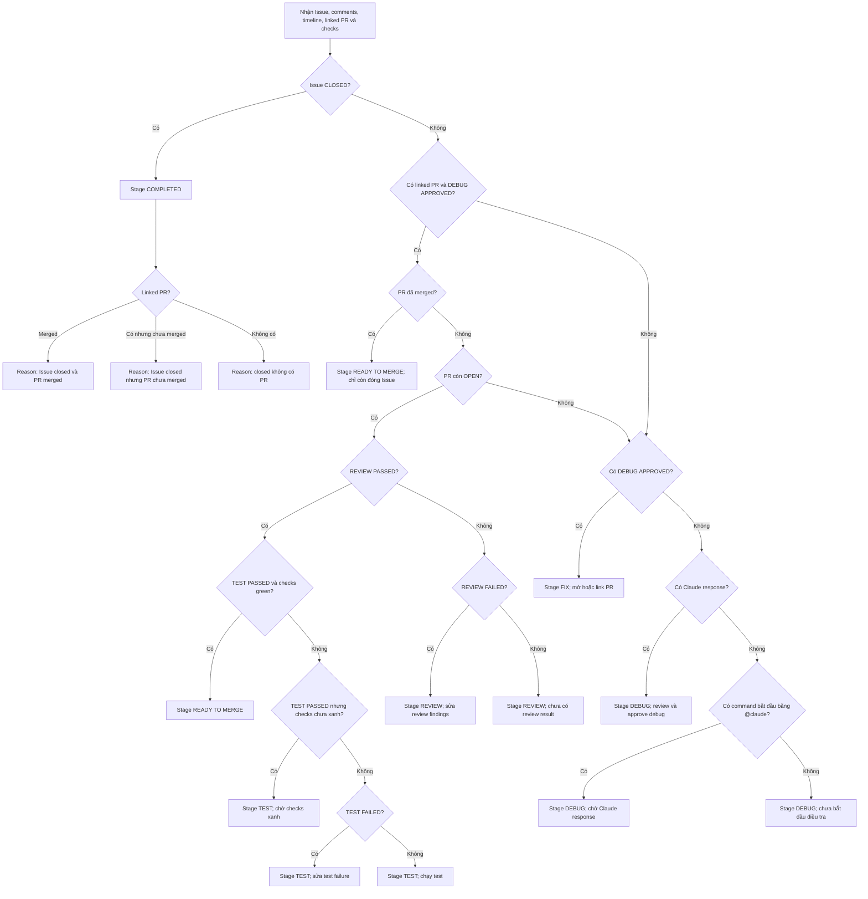

# Toàn bộ flow xử lý một GitHub Issue

## Tổng quan

Tài liệu này mô tả **hành vi đang được triển khai trong source hiện tại** của `claude_schedule`: từ lúc tạo hoặc tải một GitHub Issue, điều tra, sửa lỗi, review, test, sẵn sàng merge, đến khi Issue đóng.

GitHub là source of truth. Frontend không tự quyết định stage; frontend gửi comment/checkpoint, gọi API lấy dữ liệu mới nhất, rồi render `lifecycle.stage` do backend suy luận.

Toàn bộ flow từ tạo Issue đến đóng Issue thực hiện được trong app; không còn bước nào bắt buộc phải làm trên GitHub.

Các nguồn chính:

- `src/claude_schedule/lifecycle/engine.py` — cây quyết định stage và stage report/owner.
- `src/claude_schedule/api/routes.py` — API orchestration.
- `src/claude_schedule/github/service.py` — đọc/ghi GitHub, tìm linked PR, merge và close.
- `src/claude_schedule/lifecycle/timeline.py` — parse Claude response và activity.
- `frontend/src/lib/quick-actions.ts` — action Manual/Claude theo stage.
- `frontend/src/lib/lifecycle-progress.ts` — step state và transition conditions trên UI.
- `frontend/src/hooks/use-issue-detail.ts` — load, refresh và polling.

## Thuật ngữ và thứ tự stage

| Thứ tự | Stage | Ý nghĩa |
|---:|---|---|
| 1 | `debug` | Điều tra nguyên nhân và chờ phê duyệt kết quả debug. |
| 2 | `fix` | Thực hiện sửa lỗi và chờ linked Pull Request xuất hiện. |
| 3 | `review` | Review linked PR và ghi kết quả Review. |
| 4 | `test` | Kiểm thử thay đổi và ghi kết quả Test. |
| 5 | `ready_to_merge` | Test đã pass và toàn bộ check được coi là xanh. |
| 6 | `completed` | GitHub Issue đã đóng. |

Stage không được lưu riêng trong database. Mỗi lần load/refresh, backend dựng lại stage từ Issue state, linked PR, comments và check-runs.

## Sơ đồ quyết định stage đầy đủ



## 1. Điểm vào: tạo Issue mới hoặc tải Issue có sẵn

Frontend có hai mode trong `frontend/src/App.tsx:16-105`.

### 1.1. Load Issue có sẵn

1. Người dùng nhập URL.
2. URL rỗng sau khi trim:
   - form không submit;
   - vẫn ở màn hình nhập URL.
3. URL có giá trị:
   - frontend gọi `POST /api/issues/parse-url`;
   - backend chỉ chấp nhận `http(s)://github.com/{owner}/{repo}/issues/{integer}`;
   - cho phép whitespace bên ngoài URL và trailing slash.
4. URL sai, URL PR, GitLab, path thừa hoặc issue number không phải số:
   - backend trả `422 INVALID_URL`;
   - frontend xóa target cũ và hiển thị lỗi.
5. URL hợp lệ:
   - frontend lưu `owner`, `repository`, `issueNumber`;
   - render `IssueDetailPage` và bắt đầu load detail.

Nguồn: `frontend/src/components/issue-url-form.tsx:12-28`, `src/claude_schedule/github/url_parser.py:3-16`.

### 1.2. Tạo Issue mới

Khi mở form Create:

1. Frontend gọi `GET /api/config` để prefill owner/repository.
2. Nếu config load thành công, điền owner/repository.
3. Nếu config lỗi, lỗi bị bỏ qua; user vẫn có thể nhập tay.
4. Nút Create chỉ bật khi có:
   - owner;
   - repository;
   - title;
   - steps to reproduce;
   - expected result;
   - actual result.
5. Các field optional rỗng được gửi thành `null`.

Backend xử lý `POST /api/issues/{owner}/{repository}` theo thứ tự:

1. Kiểm tra repository guard.
2. Validate và trim payload.
3. Tạo body có các section cố định:
   - Environment — rỗng thì ghi `Not specified`;
   - Steps to Reproduce;
   - Expected Result;
   - Actual Result.
4. Có `additional_notes` thì thêm Additional Notes; không có thì bỏ section.
5. Tạo từng label độc lập:
   - có environment → `env:{value}`;
   - có base branch → `base:{value}`;
   - có severity → `severity:{value}`;
   - không có metadata → labels rỗng.
6. Có assignee → gửi `assignees: [username]`; không có → không gửi field `assignees`.
7. GitHub tạo Issue thật và trả Issue đã map.
8. Frontend chuyển về mode Load, đặt Issue mới làm target và mở detail.

Validation branches:

- Required text chỉ có whitespace → `422 VALIDATION_ERROR`.
- Title tối đa 256 ký tự.
- Giá trị label được giới hạn để tổng prefix + value không quá 50 ký tự.
- Optional text chỉ có whitespace → `None`.
- Comment phải có độ dài từ 1 đến 65.536 ký tự sau validation.

Nguồn: `frontend/src/components/issue-create-form.tsx:28-70`, `src/claude_schedule/api/schemas.py:63-112`, `src/claude_schedule/api/issue_template.py:4-31`.

## 2. Load toàn bộ dữ liệu của Issue

`GET /api/issues/{owner}/{repository}/{issue_number}` thực hiện:

1. Repository không được phép → dừng với `403 REPOSITORY_NOT_ALLOWED`.
2. Repository được phép → chạy song song:
   - lấy Issue;
   - lấy toàn bộ Issue comments;
   - lấy toàn bộ Issue timeline.
3. Tìm linked PR từ timeline.
4. Không tìm thấy PR:
   - `pr_comments = []`;
   - `pr_commits = []`;
   - `pr_checks = []`.
5. Tìm thấy PR:
   - chạy song song PR conversation comments, PR reviews, PR commits và check-runs của head SHA;
   - gộp conversation comments với reviews đã submit thành `pr_comments`, sort theo thời gian.
6. Gọi `infer_stage()`.
7. Ghép unified activity timeline.
8. Trả một response gồm Issue, linked PR, comments, commits, checks, activity và lifecycle.

Review submit qua GitHub review UI (Files changed → Approve/Request changes) được đọc như comment, nên marker `REVIEW PASSED` viết trong review body vẫn có hiệu lực. Review còn ở trạng thái pending, hoặc review không có body, bị bỏ qua vì không mang verdict.

Nếu bất kỳ request nào trong một `asyncio.gather()` lỗi, toàn request detail lỗi; source không trả partial data.

Nguồn: `src/claude_schedule/api/routes.py`, `src/claude_schedule/github/service.py`.

## 3. Cách chọn linked Pull Request

Backend quét toàn bộ Issue timeline trong `src/claude_schedule/github/service.py:172-206`.

Với mỗi event:

1. Không có `source.issue` → bỏ qua.
2. `source.issue` không có `pull_request` → bỏ qua.
3. Có `repository.full_name` và khác repository đang load → bỏ qua.
4. Không có repository metadata → vẫn nhận candidate.
5. Có timestamp → dùng timestamp event.
6. Không có timestamp → dùng `datetime.min`.
7. Không có candidate → linked PR là `None`.
8. Có nhiều candidate → sort theo timestamp và chọn candidate mới nhất.
9. Fetch chi tiết PR được chọn.

Source không yêu cầu tên event phải là `cross-referenced`; cấu trúc `source.issue.pull_request` mới là điều kiện quyết định.

## 4. Pagination và check-runs

Issue comments, Issue timeline, PR comments, PR commits và check-runs đều được phân trang.

```text
next_url còn giá trị?
├─ Không → kết thúc và trả toàn bộ items
└─ Có
   ├─ URL đã đọc → GitHubError pagination loop
   ├─ Request page
   ├─ Có list_key → lấy payload[list_key], thiếu key thành []
   ├─ Không list_key → dùng toàn payload
   ├─ Page không phải list → GitHubError
   ├─ Append items
   └─ Có Link rel=next → lặp page tiếp theo
```

Khi lấy checks:

- route đã có `head_sha` → dùng trực tiếp;
- không có `head_sha` → fetch PR rồi lấy `pull_request.head_sha`.

Nguồn: `src/claude_schedule/github/client.py:42-73`, `src/claude_schedule/github/service.py:225-243`.

## 5. Quy tắc nhận diện command, marker và response

### 5.1. Human/Claude command

- Command phải bắt đầu bằng `@claude`, không phân biệt hoa thường.
- Mỗi command được xếp vào **đúng một** stage, theo thứ tự:
  1. Command yêu cầu marker `REVIEW PASSED`/`REVIEW FAILED` → Review; yêu cầu `TEST PASSED`/`TEST FAILED` → Test. Command tự khai stage của nó qua marker mà nó đòi.
  2. Không đòi marker nào, hoặc đòi cả hai → xét keyword trần: chứa `review` → Review; chứa `test`, `tests`, `testing` hoặc `ci` → Test.
  3. Không khớp gì → không thuộc stage nào, không vô hiệu result nào.
- Phân loại một-stage là bắt buộc vì keyword không thuộc riêng stage nào: prompt Review app gửi có cụm "test coverage", còn một yêu cầu test có thể nhắc tới review vừa xong. Xem `_command_stage()`.
- `last_command` là command mới nhất trên tập hợp Issue comments + PR comments đã sort theo thời gian.

### 5.2. Result marker

Marker chỉ hợp lệ khi nằm trên **một dòng riêng**, không phân biệt hoa thường:

```text
REVIEW PASSED
REVIEW FAILED
TEST PASSED
TEST FAILED
```

Hệ quả:

- Prompt nhắc “report REVIEW PASSED or REVIEW FAILED” không phải result.
- Marker có thể do operator hoặc Claude viết; engine không kiểm tra author của marker.
- Engine quét comments từ mới đến cũ.
- Gặp command mới được xếp đúng stage đang xét trước result cũ → trả `None`; attempt mới vô hiệu result cũ.
- Gặp `@claude` command thuộc stage khác → bỏ qua và tiếp tục tìm. Một lần re-review không còn xoá `TEST PASSED` đã ghi, và ngược lại.
- Gặp marker hợp lệ mới nhất → marker đó thắng.
- Nếu cùng một comment chứa cả PASSED và FAILED trên các dòng riêng, pattern PASSED được kiểm tra trước và thắng.

Nguồn: `src/claude_schedule/lifecycle/engine.py:14-64`.

### 5.3. Claude response

Comment được xem là Claude response khi `author == CLAUDE_BOT_LOGIN`.

Parser nhận các heading:

- `Root Cause`;
- `Finding` hoặc `Findings`;
- `Test Result` hoặc `Test Results`.

Không có heading hợp lệ → unstructured response, chỉ giữ raw body.

Có ít nhất một heading → structured response:

- section rỗng thành `None` hoặc list rỗng;
- findings tách theo dòng không trống và bỏ dấu `-` đầu dòng;
- latest Claude response được chọn từ cả Issue và PR comments.

Nguồn: `src/claude_schedule/lifecycle/timeline.py:20-61`.

## 6. Cây `if/elif/else` suy luận lifecycle

Đây là thứ tự thực thi chính xác trong `infer_stage()`. Điều kiện ở trên thắng điều kiện phía dưới.

### 6.1. Nhánh ưu tiên 1 — Issue đã đóng

Điều kiện: `issue.state == closed`.

Kết quả luôn là `completed`, bất kể comment, marker, CI hoặc PR state.

Các nhánh reasoning:

| Linked PR | Merged | Reasoning |
|---|---:|---|
| Có | Có | Issue đóng và linked PR đã merge. |
| Có | Không | Issue đóng nhưng linked PR chưa merge. |
| Không | — | Issue đóng không có linked PR, ví dụ đóng vì không phải bug. |

Next action luôn là không cần hành động thêm.

### 6.2. Nhánh ưu tiên 2 — Issue mở, có linked PR, và đã `DEBUG_APPROVED`

Nhánh này chỉ được xét khi linked PR tồn tại **và** đã có `[LIFECYCLE:DEBUG_APPROVED]` trong Issue comments. Thiếu `DEBUG_APPROVED` (ví dụ PR được cross-reference vào Issue nhưng operator chưa approve debug) sẽ rơi thẳng về nhánh Fix/Debug ở mục 6.3 — flow không được phép nhảy cóc qua Review chỉ vì tình cờ có PR liên kết.

#### A0. PR đã merged nhưng Issue còn mở

Kết quả: stage `ready_to_merge`, next action là đóng Issue.

Merge làm PR rời trạng thái `open`, nên nếu không có nhánh này flow sẽ tụt ngược về Fix trong khoảng thời gian giữa lúc merge và lúc Issue được đóng. Trường hợp này xảy ra khi PR không mang closing keyword, ví dụ PR được link bằng comment thay vì được app tạo.

Các nhánh A–D dưới đây chỉ áp dụng khi PR còn `open`. PR bị đóng mà **không** merge nghĩa là fix bị bỏ, và flow quay về Fix ở mục 6.3.

Bên trong nhánh PR đang mở, **Review luôn là điều kiện tiên quyết** trước khi xét Test hay Ready to Merge — không thể vào Ready to Merge nếu chưa có `REVIEW PASSED`.

#### A. Không có Review pass, nhưng `REVIEW FAILED`

Kết quả: stage `review`, next action là sửa review findings.

- Latest Claude response structured → đưa findings của response đó vào `review_findings`.
- Không có structured Claude response → `review_findings` rỗng, kể cả manual comment có nội dung findings.

#### B. Không có Review pass/fail

Kết quả: stage `review`, next action là post `@claude` review command.

#### C. `REVIEW PASSED`, và `TEST PASSED` với checks green

Kết quả: `ready_to_merge`.

Điều kiện checks green:

- phải có ít nhất một check;
- mọi `conclusion` đều thuộc `success`, `neutral`, `skipped`.

Không green nếu:

- không có check;
- có conclusion `None` dù status có thể đang chạy;
- có failure, cancelled, timed_out, action_required hoặc conclusion khác whitelist.

Engine chỉ xét `conclusion`, không xét `status` riêng.

#### D. `REVIEW PASSED`, nhưng chưa đạt Ready

- `TEST PASSED` nhưng checks chưa green → stage `test`, next action là chờ checks pass.
- `TEST FAILED` → stage `test`, next action là sửa test failure.
- Chưa có marker Test nào → stage `test`, next action là chạy test.

### 6.3. Nhánh ưu tiên 3 — Không có linked PR, PR đã đóng không merge, hoặc chưa `DEBUG_APPROVED`

Nhánh này áp dụng khi:

- không có linked PR; hoặc
- có linked PR nhưng PR đã đóng mà không merge; hoặc
- có linked PR nhưng Issue chưa từng nhận `[LIFECYCLE:DEBUG_APPROVED]`.

#### A. Có `[LIFECYCLE:DEBUG_APPROVED]` trong Issue comment

Kết quả: stage `fix`.

- Chưa có PR nào → next action là chờ Claude mở PR.
- PR cũ đã đóng không merge → next action là mở PR mới.

Marker approval không kiểm tra author và không bắt buộc phải có Claude response trước đó.

#### B. Chưa approve nhưng đã có Claude response

Kết quả: stage `debug`, chờ operator review và approve kết quả debug.

#### C. Chưa có response nhưng đã có `@claude` command

Kết quả: stage `debug`, chờ Claude GitHub Action phản hồi.

#### D. Chưa có command

Kết quả: stage `debug`, đề xuất post `@claude` debug command.

### 6.4. Các trường luôn được báo cáo

`review_result`, `test_result`, `debug_approved` và `checks_green` được tính một lần và trả về ở **mọi** stage, không riêng stage gate trên chúng. Nhờ vậy UI không bao giờ yêu cầu operator post lại một marker họ đã post — ví dụ `TEST PASSED` đã ghi nhưng checks còn chạy thì `test_result` vẫn là `PASSED`.

`checks_green` là verdict duy nhất về CI: frontend đọc thẳng field này thay vì tự tính lại từ `pr_checks`, nên phần đếm check trên UI không thể mâu thuẫn với stage mà engine suy ra.

### 6.5. Stage report và stage owner

Mỗi Claude comment được xếp vào đúng một stage theo nội dung nó khai báo, và mỗi stage giữ report mới nhất của mình, nên phân tích Debug vẫn còn trên màn hình sau khi flow đã sang Review hay Test.

Thứ tự quyết định:

1. Có marker Review → `review`.
2. Có marker Test → `test`.
3. Có `Root Cause` → `debug`.
4. Có `Solution` → `fix`.
5. Có `Summary` hoặc `Remaining Risk` → `completed` nếu comment được viết từ lúc Issue đã đóng trở đi, ngược lại `ready_to_merge`.

Bước 5 dùng mốc thời gian vì prompt Ready to Merge và prompt Completed dùng chung bộ heading; chỉ trạng thái Issue tại thời điểm viết mới phân biệt được closing note với merge-readiness check.

Stage owner lấy từ chính record mà stage dựa vào (approval, PR, comment mang marker). Stage không có actor chứng minh được thì bỏ trống thay vì đoán.

## 7. Hai lựa chọn ở từng stage

Mọi stage đều có hai tab:

1. **Manual comment** — user tự viết nội dung.
2. **Ask Claude** — frontend prefill prompt `@claude`, user vẫn được sửa trước khi post.

| Stage | Target | Manual | Ask Claude |
|---|---|---|---|
| Debug | Issue | Ghi investigation, reproduction hoặc root cause. | Yêu cầu điều tra root cause và evidence. |
| Fix | Issue | Ghi progress, decision hoặc WIP link. | Yêu cầu implement, thêm tests và mở linked PR. |
| Review | Linked PR | Ghi findings; marker Review phải ở dòng riêng để đổi stage. | Yêu cầu review correctness, regression, coverage và result marker. |
| Test | Linked PR | Ghi test evidence; marker Test phải ở dòng riêng. | Yêu cầu chạy test, kiểm tra CI và result marker. |
| Ready to Merge | Linked PR | Ghi merge decision, rollout note hoặc final verification. | Yêu cầu readiness check; prompt nói rõ không tự merge. |
| Completed | Issue | Ghi closing summary, deployment note hoặc follow-up. | Yêu cầu tóm tắt resolution, tests và follow-up. |

Nguồn: `frontend/src/lib/quick-actions.ts`.

Ngoài composer, một số stage có action thao tác thẳng lên GitHub:

| Stage | Action | Endpoint | Ghi chú |
|---|---|---|---|
| Debug | Approve debug | `POST /api/issues/{o}/{r}/{n}/checkpoints` | Checkpoint duy nhất. |
| Fix | Create Pull Request | `POST /api/issues/{o}/{r}/{n}/pull-request` | Body là `Closes #n`, nên merge sẽ tự đóng Issue. |
| Fix | Link Pull Request | `POST /api/pull-requests/{o}/{r}/{pr}/comments` | Comment cross-reference cho PR mở ngoài flow; **không** mang closing keyword. |
| Ready to Merge | Merge Pull Request | `POST /api/pull-requests/{o}/{r}/{pr}/merge` | Có bước confirm; merge method mặc định `squash`, chọn được `merge`/`rebase`. |
| Ready to Merge | Close Issue | `POST /api/issues/{o}/{r}/{n}/close` | Có bước confirm; chỉ cần khi merge không tự đóng Issue. |

Create/Link PR chỉ hiện ở Fix khi chưa có linked PR. Merge chỉ hiện khi PR chưa merge; Close chỉ hiện khi Issue còn mở. Khi cả hai điều kiện đã xong, panel không render.

GitHub từ chối merge (conflict, branch protection, head đã đổi) trả `409 MERGE_NOT_ALLOWED` và UI hiện nguyên message của GitHub; flow giữ nguyên stage.

Nguồn: `frontend/src/components/completion-actions.tsx`, `frontend/src/components/create-pull-request-form.tsx`, `frontend/src/components/link-pull-request-form.tsx`.

### 7.1. Target và nhánh không có PR

- Debug, Fix, Completed post vào Issue.
- Review, Test, Ready to Merge post vào linked PR.
- Stage cần PR nhưng `linkedPullRequest == null`:
  - target number là `null`;
  - hiện warning;
  - textarea và nút Review bị disable;
  - không thể post comment từ UI.

### 7.2. Confirmation flow

1. Mặc định composer ở Manual.
2. Chọn Manual → body rỗng và dùng placeholder theo stage.
3. Chọn Ask Claude → body được điền prompt theo stage.
4. Đổi mode → reset confirmation và success URL cũ.
5. Stage hoặc Issue đổi → reset mode, body, confirmation và success state.
6. Body rỗng hoặc target `null` → không post.
7. Click Review → mở confirmation.
8. Cancel → quay lại editor, không post.
9. Confirm:
   - target Issue → gọi Issue comment API;
   - target PR → gọi PR comment API.
10. Post lỗi → giữ màn hình và hiện error; không gọi refresh callback.
11. Post thành công:
   - hiện link GitHub;
   - Manual reset body rỗng;
   - Ask Claude reset về prompt mặc định;
   - refresh Issue detail.

Nguồn: `frontend/src/components/command-composer.tsx:26-152`, `frontend/src/hooks/use-post-comment.ts:13-57`.

## 8. Debug approval checkpoint

Frontend chỉ render checkpoint panel khi stage là `debug`.

Click “Approve debug and start Fix”:

1. Gửi `DEBUG_APPROVED` đến checkpoint API.
2. Backend build comment:

   ```text
   [LIFECYCLE:DEBUG_APPROVED]

   Debug result has been reviewed and accepted by @username.
   ```

3. Có operator username → dùng `@username`; trống → dùng `the operator`.
4. Post thành công → hiện URL và refresh.
5. Post lỗi → hiện error.
6. Không có bước confirm/cancel cho checkpoint này.

`DEBUG_APPROVED` là checkpoint duy nhất trong hệ thống và luôn post vào Issue. Các checkpoint chưa từng được frontend gọi tới (`PR_READY_FOR_REVIEW`, `REVIEW_CONFIRMED`, `TEST_CONFIRMED`, `PR_MERGED`) đã được xóa khỏi backend enum và frontend types vì không có UI trigger và không ảnh hưởng lifecycle engine.

Nguồn: `frontend/src/components/checkpoint-panel.tsx:22-63`, `src/claude_schedule/lifecycle/models.py`, `src/claude_schedule/api/routes.py`.

## 9. Polling Claude và chống race condition

Sau khi post comment:

- body sau trim bắt đầu bằng `@claude` → refresh ngay và bật polling;
- không bắt đầu bằng `@claude` → chỉ refresh, không polling;
- chọn tab Claude nhưng xóa hoặc di chuyển `@claude` khỏi đầu cũng không polling.

Polling flow:

1. Lưu timestamp local lúc post.
2. Đặt attempts về 0 và waiting = true.
3. Mỗi 15 giây gọi load detail.
4. Tối đa 20 attempts, xấp xỉ 5 phút.
5. Load trả `null` do lỗi/abort → vòng sau vẫn có thể tiếp tục.
6. Dừng sớm khi:
   - có activity `claude_response` mới hơn timestamp post; hoặc
   - trước đó chưa có PR nhưng lần load mới đã có linked PR.
7. Hết 20 attempts → dừng waiting; user phải refresh thủ công.

Race protection:

- trước request mới, abort request đang chạy;
- mỗi request có sequence number;
- response có sequence cũ không được ghi đè data mới;
- abort/stale response không hiển thị error;
- đổi Issue reset data, waiting và poll attempts.

Nguồn: `frontend/src/hooks/use-issue-detail.ts:17-104`.

## 10. Unified activity timeline

Backend ghép activity theo các rule:

- comment có author đúng Claude login → `claude_response`;
- mọi comment khác → `human_command`, kể cả checkpoint hoặc comment thường;
- PR commits và Issue timeline events → `github_system`;
- check-runs → `ci_workflow`;
- PR comments/commits/checks chỉ được thêm khi có linked PR;
- bỏ các timeline event dễ trùng: `commented`, `committed`, `line-commented`, `mentioned`, `subscribed`;
- giữ các event khác;
- summary lấy dòng không trống đầu tiên;
- summary dài quá 140 ký tự → cắt và thêm `…`;
- check timestamp ưu tiên `completed_at`, nếu thiếu dùng `started_at`;
- sort tăng dần theo timestamp; item không timestamp dùng chuỗi rỗng và đứng đầu.

Frontend:

- activity rỗng → “No activity yet”;
- có activity → render category, source, actor, local time, summary và GitHub link nếu có.

Nguồn: `src/claude_schedule/lifecycle/timeline.py:74-150`, `frontend/src/components/activity-timeline.tsx:8-20`.

## 11. Error và validation branches

| Điều kiện | API code/status | UI |
|---|---|---|
| Invalid Issue URL | `422 INVALID_URL` | Invalid Issue URL |
| Validation lỗi | `422 VALIDATION_ERROR` | Please check the form |
| Repo không tồn tại | `404 REPO_NOT_FOUND` | Repository not found |
| Issue không tồn tại | `404 ISSUE_NOT_FOUND` | Issue not found |
| PR không tồn tại | `404 PR_NOT_FOUND` | Pull Request not found |
| Token sai/hết hạn | `401 TOKEN_INVALID` | GitHub token invalid or expired |
| Repo private/thiếu scope | `403 PRIVATE_OR_NO_SCOPE` | Permission denied |
| Repo không được cấu hình | `403 REPOSITORY_NOT_ALLOWED` | Repository not enabled |
| Rate limit, remaining = 0 | `429 RATE_LIMITED` | Hiện retry seconds nếu có |
| GitHub từ chối payload/comment | `422 COMMENT_REJECTED` | Comment rejected by GitHub |
| GitHub từ chối merge (conflict, branch protection, head đã đổi) | `409 MERGE_NOT_ALLOWED` | GitHub refused the merge |
| GitHub timeout | `504 GITHUB_TIMEOUT` | GitHub API timed out |
| Transport/HTTP lỗi khác | `502 GITHUB_ERROR` | GitHub API error |
| Non-JSON error response ở frontend | Fallback theo HTTP status | Message status-based |
| Error thường ngoài `ApiError` | — | Something went wrong |

Initial load branches:

- loading và chưa có data → chỉ hiện loading banner;
- error và chưa có data → chỉ hiện error banner;
- không loading/error nhưng data vẫn null → render `null`;
- refresh lỗi nhưng đã có data → giữ stale data và hiện error banner.

Nguồn: `src/claude_schedule/github/client.py:99-131`, `src/claude_schedule/api/errors.py:19-55`, `frontend/src/components/status-banner.tsx:11-91`.

## 12. Repository guard và cấu hình

```text
RESTRICT_TO_CONFIGURED_REPOSITORY = false
└─ Cho phép mọi repository

restrict = true
├─ GITHUB_OWNER hoặc GITHUB_REPOSITORY trống
│  └─ Cho phép mọi repository
└─ Cả owner và repository đã cấu hình
   ├─ Match case-insensitive → cho phép
   └─ Không match → 403 REPOSITORY_NOT_ALLOWED
```

Các chi tiết khác:

- GitHub client được cache theo token + timeout.
- App shutdown khi chưa tạo client → không làm gì.
- App shutdown khi đã tạo client → close client và clear cache.
- CORS origins được split bằng dấu phẩy, trim và bỏ phần tử rỗng.
- CORS chỉ cho `GET`, `POST` và header `Content-Type`.

Nguồn: `src/claude_schedule/settings.py:20-37`, `src/claude_schedule/api/deps.py:10-33`, `src/claude_schedule/main.py:8-39`.

## 13. Một quy trình hoàn chỉnh từ đầu đến cuối

Đây là happy path phù hợp với UI và backend hiện tại.

1. Operator tạo Issue mới hoặc load Issue URL hợp lệ.
2. Backend load Issue; chưa có command, response, approval hoặc open PR → `debug`.
3. Tại Debug, operator chọn một trong hai:
   - Manual: post investigation note;
   - Ask Claude: post prompt bắt đầu bằng `@claude`.
4. Nếu Ask Claude, frontend polling đến khi có Claude response mới.
5. Operator đọc response rồi click `DEBUG_APPROVED`.
6. Issue vẫn mở và chưa có open PR → stage `fix`.
7. Tại Fix, operator:
   - ghi progress thủ công; hoặc
   - yêu cầu Claude implement, thêm tests và mở PR; hoặc
   - bấm Create Pull Request để mở PR từ fix branch; hoặc
   - bấm Link để trỏ tới PR đã mở sẵn ngoài flow.
8. PR được link vào Issue timeline và đang open → stage `review`.
9. Tại Review, operator hoặc Claude post kết quả trên PR:

   ```text
   REVIEW PASSED
   ```

10. Backend refresh → stage `test`.
11. Tại Test, operator hoặc Claude post evidence và marker:

    ```text
    TEST PASSED
    ```

12. Nếu chưa có check hoặc check chưa green → vẫn ở `test`, `test_result` vẫn báo `PASSED`.
13. Khi có ít nhất một check và tất cả conclusion là success/neutral/skipped → `ready_to_merge`.
14. Tại Ready to Merge, operator bấm Merge Pull Request rồi Confirm.
15. PR do app tạo mang `Closes #number`, nên merge tự đóng Issue. PR được link bằng comment thì không, và operator bấm Close Issue — stage vẫn là `ready_to_merge` cho tới lúc đó.
16. Lần refresh sau, Issue closed thắng mọi nhánh → `completed`.
17. Tại Completed, operator vẫn có thể post closing note thủ công hoặc yêu cầu Claude tóm tắt; stage vẫn Completed vì Issue còn closed.

## 14. Alternate flows và vòng lặp

### Debug

- Manual note không tự đổi stage.
- Claude response không tự đổi sang Fix; vẫn cần approval.
- Approval có thể được post trước Claude response và vẫn đưa Issue sang Fix nếu chưa có open PR.

### Fix

- Không có PR → tiếp tục Fix nếu đã approve.
- Linked PR closed không merge → quay về Fix với action mở PR mới.
- Linked PR đã merged nhưng Issue còn mở → `ready_to_merge`, không tụt về Fix.

### Review

- `REVIEW FAILED` → ở Review, sửa findings rồi có thể post command review mới.
- Command review mới → vô hiệu Review result cũ, không đụng tới Test result đã ghi.
- Marker nằm giữa câu → không hợp lệ, vẫn ở Review.

### Test

- `TEST FAILED` + Review passed → ở Test với action sửa test failure.
- Command test mới → vô hiệu Test result cũ, không đụng tới Review result đã ghi.
- `TEST PASSED` nhưng không có checks → ở Test.
- `TEST PASSED` nhưng có check pending/failure → ở Test, action là chờ checks pass.

### Ready to Merge

- Merge bị GitHub từ chối → `409 MERGE_NOT_ALLOWED`, stage không đổi, operator xử lý conflict rồi thử lại.
- Merge xong mà Issue chưa đóng → vẫn ở Ready to Merge, chỉ còn action Close Issue.

### Completed không qua merge

- Issue đóng dù PR chưa merge → Completed.
- Issue đóng không có PR → Completed.
- Vì closure là điều kiện ưu tiên cao nhất, app không ép buộc quy trình phải đi qua mọi stage.

## 15. Current-source caveats cần biết

Các điểm dưới đây là **hành vi code hiện tại**, không nên mặc định xem là business rule mong muốn:

1. Marker và `DEBUG_APPROVED` không xác thực author; bất kỳ comment author nào cũng có thể kích hoạt (bao gồm người ngoài operator/Claude nếu repo public).
2. Khi Review failed, findings chỉ lấy từ latest structured Claude response, không parse manual findings tương ứng.
3. Tìm linked PR chấp nhận timeline candidate thiếu repository metadata.
4. Nếu nhiều linked PR, chỉ candidate mới nhất được dùng; PR cũ không còn tham gia inference. Link nhầm một PR khác sẽ đổi PR mà lifecycle bám vào.
5. Completed chỉ cần Issue closed; merge không phải điều kiện bắt buộc. Đóng Issue là hành động thật trên GitHub và có thể do người khác thực hiện, nên đây vẫn là lối thoát được phép "bỏ ngang" flow. Khi đó stepper chỉ đánh dấu done những step thật sự có bằng chứng, không tô xanh toàn bộ.

Đã sửa (không còn là caveat):

- Trước đây `TEST PASSED + checks green` được xét trước `REVIEW PASSED`, cho phép vào Ready to Merge mà không có Review pass. Nay Review phải `PASSED` trước khi Test/Ready được xét.
- Trước đây một PR cross-reference vào Issue có thể đưa lifecycle thẳng sang Review dù chưa từng `DEBUG_APPROVED`, bỏ qua Debug/Fix. Nay nhánh Review/Test/Ready yêu cầu `debug_approved == true`.
- Bốn checkpoint không được UI/engine sử dụng (`PR_READY_FOR_REVIEW`, `REVIEW_CONFIRMED`, `TEST_CONFIRMED`, `PR_MERGED`) đã bị xóa khỏi backend và frontend.
- Trước đây `TEST PASSED` nhưng checks chưa green trả `test_result = null`, khiến UI bảo operator post lại marker đã post. Nay mọi verdict đã ghi đều được báo cáo ở mọi stage.
- Trước đây frontend tự tính "checks green" chỉ chấp nhận `success`, lệch với backend vốn chấp nhận cả `neutral` và `skipped`. Nay backend trả `checks_green` và frontend đọc thẳng field đó.
- Trước đây checklist của Review liệt kê "CI checks green" dù engine không gate trên nó. Nay Review chỉ gate trên verdict.
- Trước đây Issue closed làm mọi step hiển thị done và tiến độ 100% kể cả khi flow bị bỏ ngang. Nay mỗi step chỉ done khi có bằng chứng tương ứng.
- Trước đây closing note của Claude bị xếp nhầm vào Ready to Merge vì trùng heading; panel Completed không bao giờ hiện Summary. Nay thời điểm viết so với `closed_at` quyết định.
- Trước đây verdict submit qua GitHub review UI không được đọc vì chỉ conversation comments được fetch. Nay reviews đã submit cũng được đọc.
- Trước đây merge và close phải làm trên GitHub. Nay app có endpoint cho cả hai, và PR đã merged không còn làm stage tụt về Fix.
- Trước đây một command vô hiệu result của mọi stage có keyword xuất hiện trong body. Prompt Review app gửi chứa "test coverage", nên re-review xoá luôn `TEST PASSED` đã ghi. Nay mỗi command chỉ thuộc một stage và chỉ vô hiệu result của stage đó (Issue #26).

## 16. Nhánh còn thiếu regression test riêng

Theo test suite hiện tại, các nhánh sau chưa có test riêng hoặc chưa được bao phủ trực tiếp:

- Marker/checkpoint từ author không đáng tin cậy.
- Nhiều linked PR, PR khác repository, timeline thiếu repository/timestamp.
- Pagination loop, paginated payload sai kiểu, thiếu `list_key`.
- Check cancelled, timed_out và action_required.
- Post checkpoint thành công lên PR.
- Generic HTTP transport/status errors.
- Timeline có PR, commits, skipped event và timestamp rỗng.
- Review pending hoặc review không có body bị bỏ qua.
- `409 MERGE_NOT_ALLOWED` từ GitHub client.

## References

- `docs/issue-lifecycle-runbook.md` — cùng flow này nhìn từ phía operator: bấm gì, theo thứ tự nào.
- `README.md:1-53`
- `src/claude_schedule/lifecycle/engine.py`
- `src/claude_schedule/lifecycle/models.py`
- `src/claude_schedule/lifecycle/timeline.py`
- `src/claude_schedule/api/routes.py`
- `src/claude_schedule/api/schemas.py`
- `src/claude_schedule/api/issue_template.py`
- `src/claude_schedule/api/errors.py`
- `src/claude_schedule/github/client.py`
- `src/claude_schedule/github/service.py`
- `src/claude_schedule/settings.py`
- `frontend/src/App.tsx`
- `frontend/src/components/command-composer.tsx`
- `frontend/src/components/checkpoint-panel.tsx`
- `frontend/src/components/completion-actions.tsx`
- `frontend/src/components/create-pull-request-form.tsx`
- `frontend/src/components/link-pull-request-form.tsx`
- `frontend/src/hooks/use-issue-detail.ts`
- `frontend/src/hooks/use-post-comment.ts`
- `frontend/src/lib/quick-actions.ts`
- `frontend/src/lib/lifecycle-progress.ts`
- `tests/api/test_routes.py`
- `tests/lifecycle/test_engine.py`
- `tests/lifecycle/test_timeline.py`
