# Runbook: xử lý một Issue từ tạo đến đóng

Quy trình thao tác trên workspace. Toàn bộ ảnh trong tài liệu này chụp từ một lần chạy thật đầu-cuối: Issue [#28](https://github.com/hieuhd10/claude_schedule/issues/28) → PR [#29](https://github.com/hieuhd10/claude_schedule/pull/29), 35 phút, ngày 2026-08-10.

Ba tài liệu, ba mục đích khác nhau:

| Tài liệu | Trả lời câu hỏi |
| --- | --- |
| `docs/issue-lifecycle-flow.md` | Engine suy luận stage như thế nào |
| `docs/issue-lifecycle-runbook.md` (file này) | Operator phải làm gì, theo thứ tự nào |
| `plans/reports/e2e-lifecycle-run-260809-1629-*.md` | Nhật ký một lần chạy khác, kèm bằng chứng |

## Chuẩn bị

```bash
.venv/bin/uvicorn claude_schedule.main:app --port 8000
cd frontend && npm run dev
```

`.env` cần `GITHUB_OWNER`, `GITHUB_REPOSITORY`, `GITHUB_TOKEN`, `OPERATOR_GITHUB_USERNAME`. Nếu Vite nhảy sang cổng khác vì 5173/5174 bận, thêm cổng đó vào `CORS_ORIGINS` — truyền qua biến môi trường lúc chạy uvicorn là đủ, không cần sửa `.env`.

Muốn Claude trả lời được thì repo phải có `.github/workflows/claude.yml` và secret `CLAUDE_CODE_OAUTH_TOKEN`.


## Tổng quan 6 bước

| Step | Thao tác trên màn hình | Điều kiện để đi tiếp |
| --- | --- | --- |
| Debug | Comment tay và/hoặc Ask Claude, rồi **Approve Debug And Start Fix** | Có root cause + checkpoint phê duyệt |
| Fix | Ask Claude implement, hoặc **Create Pull Request** / **Link** PR có sẵn | PR được link vào Issue |
| Review | Comment tay và/hoặc Ask Claude trên PR | `REVIEW PASSED` đứng riêng một dòng |
| Test | Comment tay và/hoặc Ask Claude trên PR | `TEST PASSED` riêng một dòng **và** mọi check green |
| Ready to Merge | **Merge Pull Request** → Confirm | PR merged |
| Completed | **Close Issue** → Confirm | Issue closed |

Stage không lưu trong database. Mỗi lần load, backend dựng lại từ Issue state, linked PR, comments và check-runs. Bỏ dở giữa chừng rồi quay lại sau vẫn ra đúng stage.

## Step 1 — Tạo Issue

**Report a new Issue (QA)** → điền form.

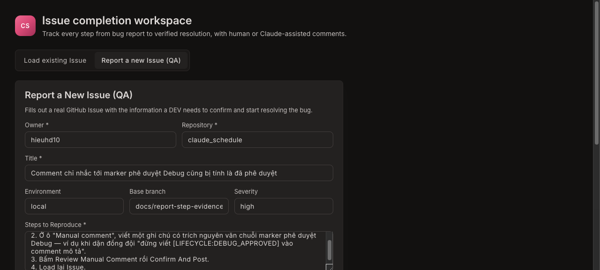

- `Base branch` là nhánh mà bản sửa sẽ nhắm tới. Điền đúng nhánh đang chứa code lỗi, đừng mặc định là nhánh default của repo. Giá trị này thành label `base:<branch>` và quyết định PR merge vào đâu.
- `Steps to Reproduce` / `Expected Result` / `Actual Result` là bắt buộc, và là phần Claude đọc để tìm root cause. Reproduce được trước khi tạo Issue thì bước Debug nhanh hơn hẳn.

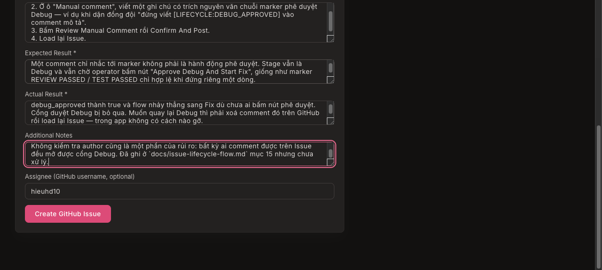

Tạo xong, workspace vào **Debug — Step 1 of 6**.

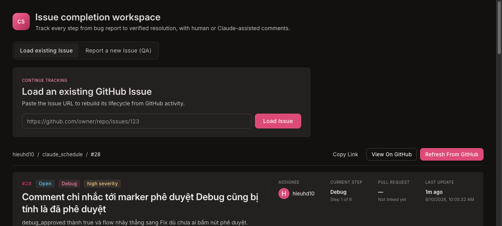

> **Bẫy:** nếu body Issue chứa chuỗi `@claude`, kể cả khi chỉ trích dẫn, workflow Claude sẽ chạy ngay lúc tạo Issue.

## Step 2 — Debug

Panel "Current Step Workspace" liệt kê điều kiện để rời step, và điều kiện nào đã đạt.

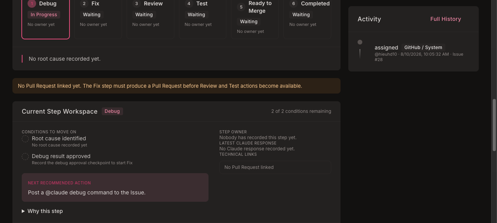

Hai lựa chọn, dùng cả hai cũng được, dùng bao nhiêu lần cũng được:

- **Manual comment** — ghi điều tra của mình. Không đổi stage.
- **Ask Claude** — prompt `@claude` soạn sẵn, sửa được trước khi gửi.

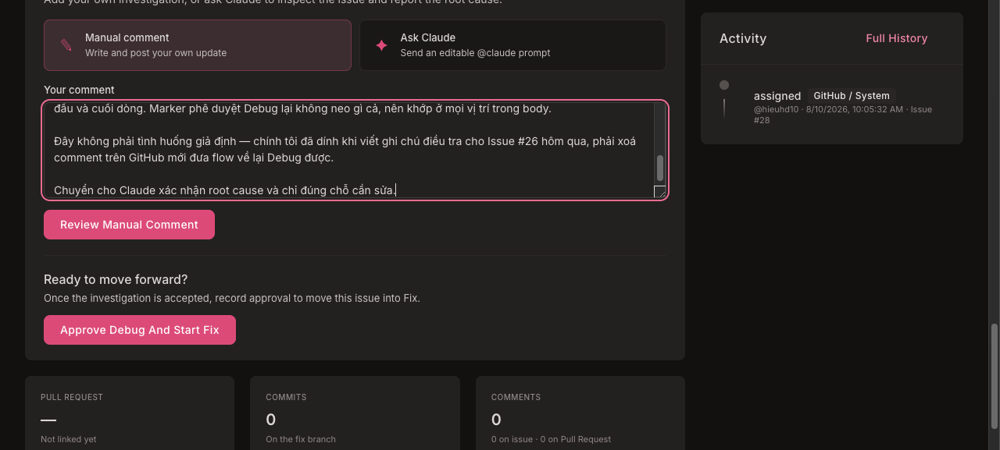

Mọi thứ gửi lên GitHub đều đi qua một bước xác nhận, hiện nguyên văn nội dung và đích đến.

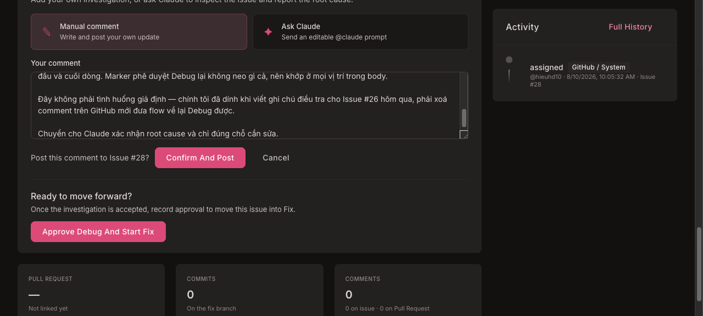

Prompt mặc định của tab Ask Claude:

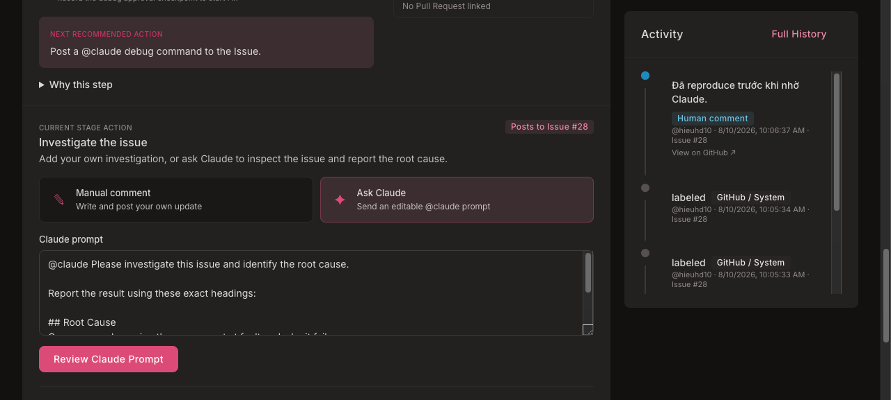

Sửa prompt là việc nên làm, không phải tuỳ chọn — xem mục [Viết prompt cho Claude](#viết-prompt-cho-claude).

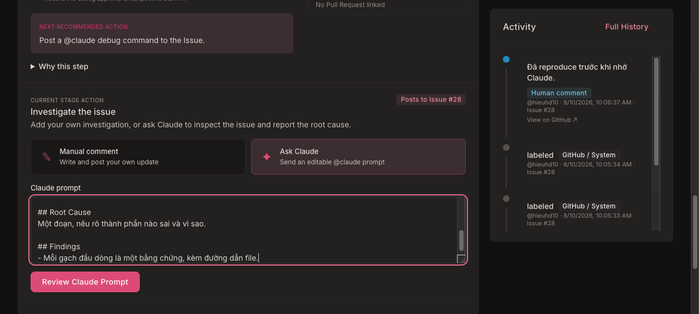

Sau khi post, UI vào trạng thái chờ và tự poll GitHub.

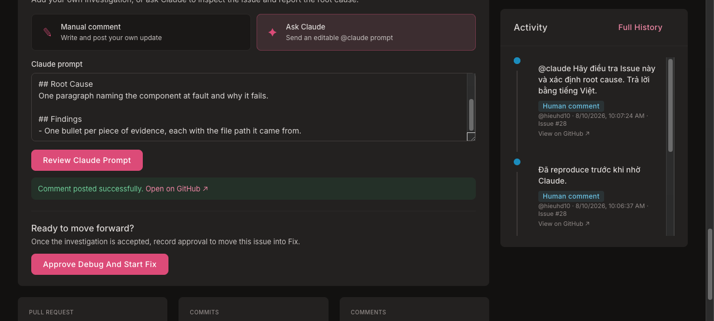

Claude trả lời trong 3m15s. Panel "Latest Claude Response" hiện kết quả, ô "Root cause identified" chuyển sang đạt.

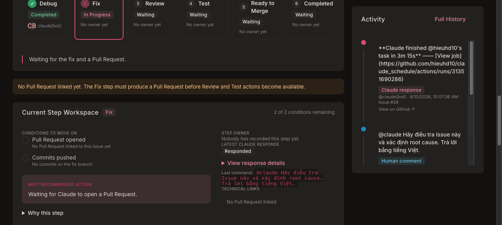

Đọc xong thì bấm **Approve Debug And Start Fix**. Nút này post comment checkpoint lên Issue.

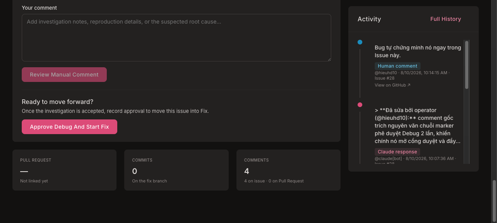

> **Bẫy:** marker phê duyệt chỉ cần đứng riêng một dòng là được tính, không cần bấm nút và không kiểm tra ai viết. Dán nguyên định dạng checkpoint vào một comment để giải thích cho đồng đội cũng mở cổng Debug thật. Trong app không có cách nào đóng lại — phải xoá hoặc sửa comment đó trên GitHub. Khi cần trích chuỗi marker, chèn `&#8203;` vào giữa để nó không khớp.
>
> Trước ngày 2026-08-10 còn tệ hơn: marker khớp ở *bất kỳ vị trí nào*, kể cả giữa câu. Chính Issue #28 sửa lỗi đó, và comment phân tích của Claude cho Issue #28 đã tự kích hoạt đúng cái lỗi nó đang mô tả vì trích nguyên văn chuỗi marker 2 lần.

## Step 3 — Fix

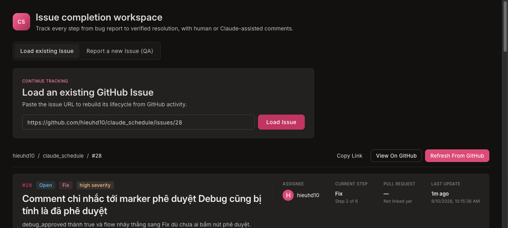

Ba đường, chọn theo tình huống:

1. **Ask Claude** implement → Claude tự mở PR.
2. **Create Pull Request** — nhập fix branch vào ô có gợi ý, base lấy từ label `base:` của Issue. Dùng khi tự code, hoặc khi Claude chỉ push nhánh mà không mở PR.
3. **Link** — nhập số PR đã mở sẵn ngoài flow.

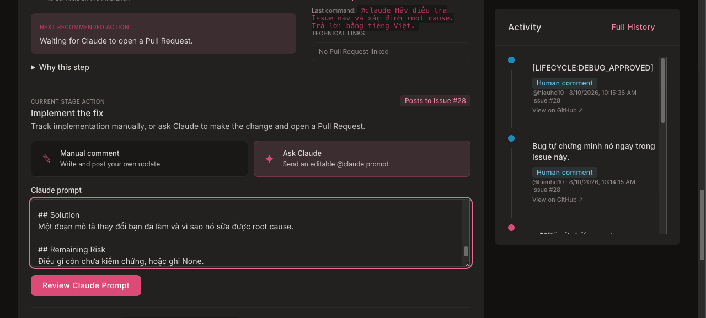

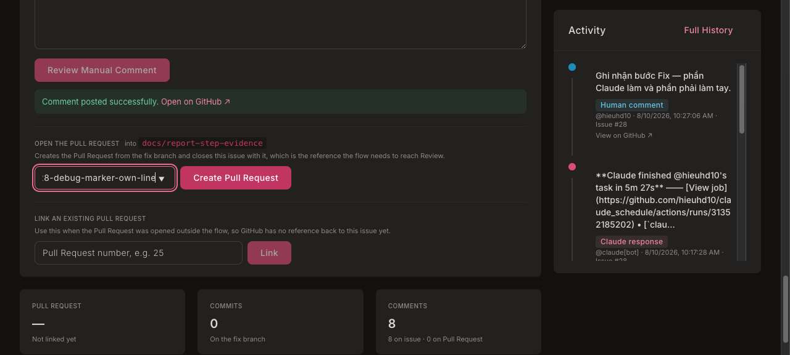

PR do form này tạo mang `Closes #<issue>`, nên merge sẽ tự đóng Issue. PR chỉ *link* bằng comment thì không, phải bấm Close Issue riêng.

Có PR đang open → stage **Review**.

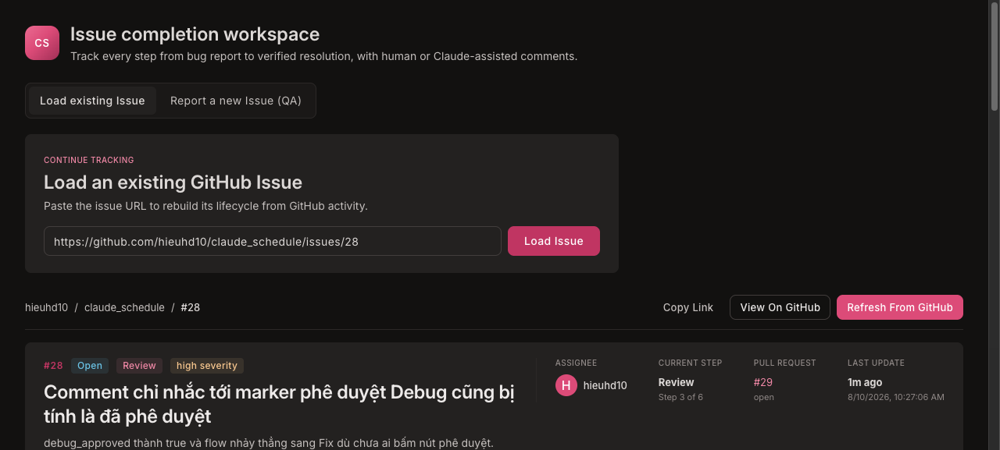

## Step 4 — Review

Post trên PR, không phải trên Issue. Kết quả chỉ được ghi nhận khi có dòng riêng `REVIEW PASSED` hoặc `REVIEW FAILED`. Marker nằm giữa câu không tính — nhờ vậy câu "hãy trả lời REVIEW PASSED hoặc REVIEW FAILED" trong prompt không bị nhầm thành kết quả.

`REVIEW FAILED` giữ nguyên stage Review; sửa xong thì post command review mới.

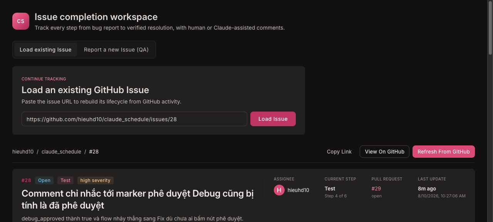

## Step 5 — Test

Tương tự, marker `TEST PASSED` / `TEST FAILED` trên PR.

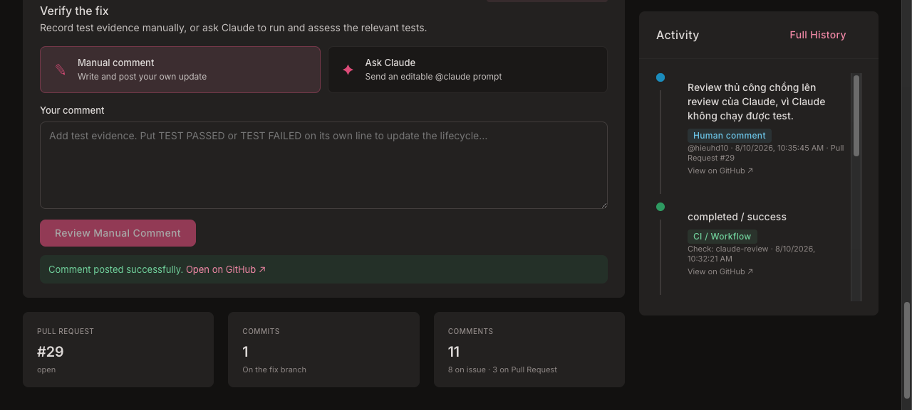

Ready to Merge cần **cả hai**: marker `TEST PASSED`, và mọi check-run của PR có conclusion `success`, `neutral` hoặc `skipped`. Không có check nào thì không đủ, vẫn ở Test.

> **Bẫy:** repo hiện không có workflow nào chạy `pytest` / `ruff` / `mypy`. Check duy nhất trên PR là job AI review. Ô "CI checks green" xanh **không** chứng minh test đã chạy. Marker `TEST PASSED` do người post sau khi chạy tay là bằng chứng test duy nhất trong flow.

## Step 6 — Ready to Merge và Completed

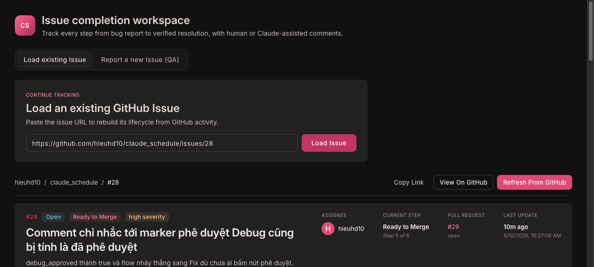

**Merge Pull Request** → chọn merge method → **Confirm Merge**.

- Mặc định là squash. Chọn "Create a merge commit" nếu muốn giữ từng commit — cần thiết khi commit của AI và commit sửa tay phải phân biệt được trong history.
- Đổi merge method sau khi đã bấm Merge sẽ huỷ bước xác nhận, phải bấm Merge lại.
- GitHub từ chối merge vì conflict hoặc branch protection → `409 MERGE_NOT_ALLOWED`, stage không đổi, xử lý rồi thử lại.

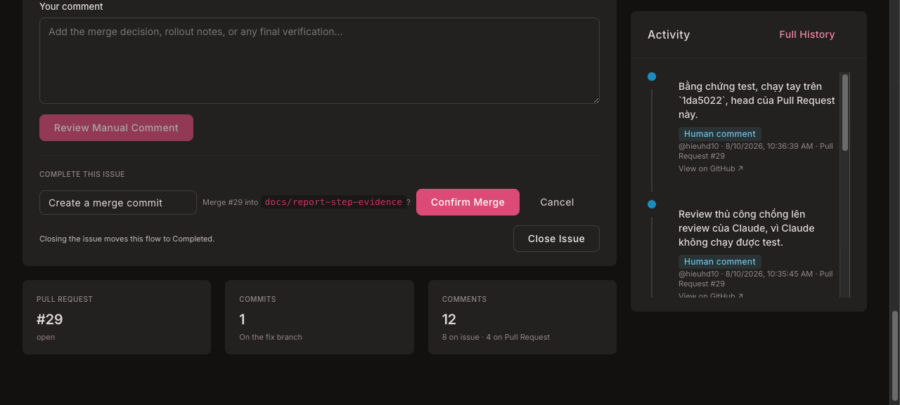

Merge xong mà Issue chưa đóng thì vẫn ở Ready to Merge, chỉ còn **Close Issue**.

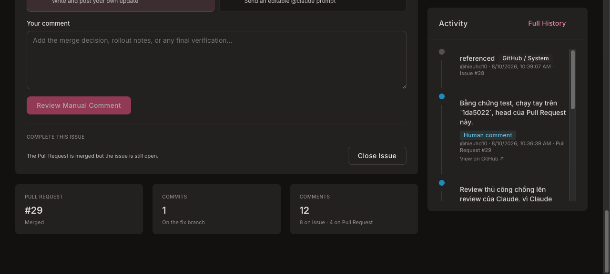
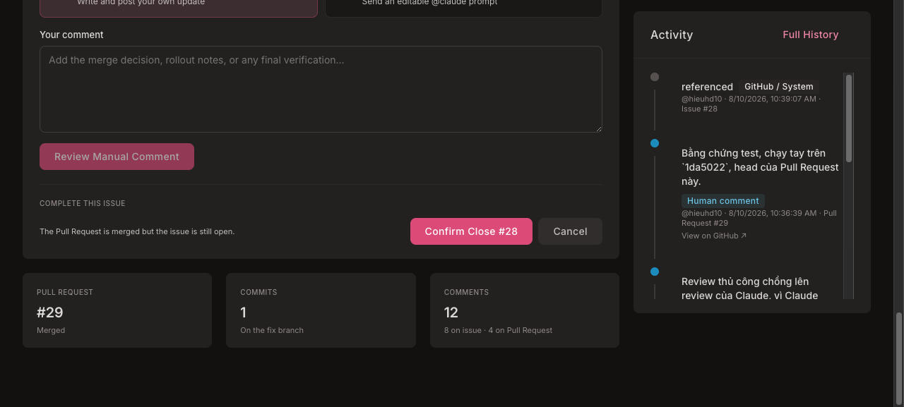

Issue closed → **Completed**.

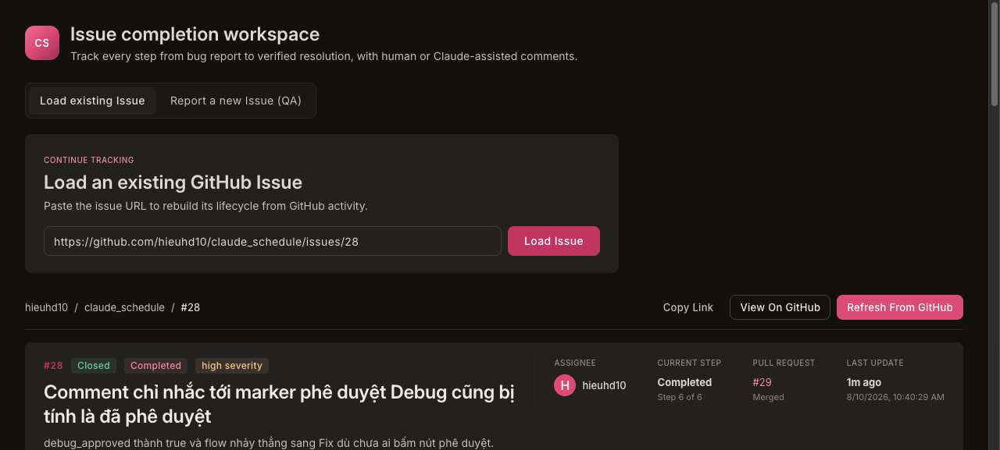
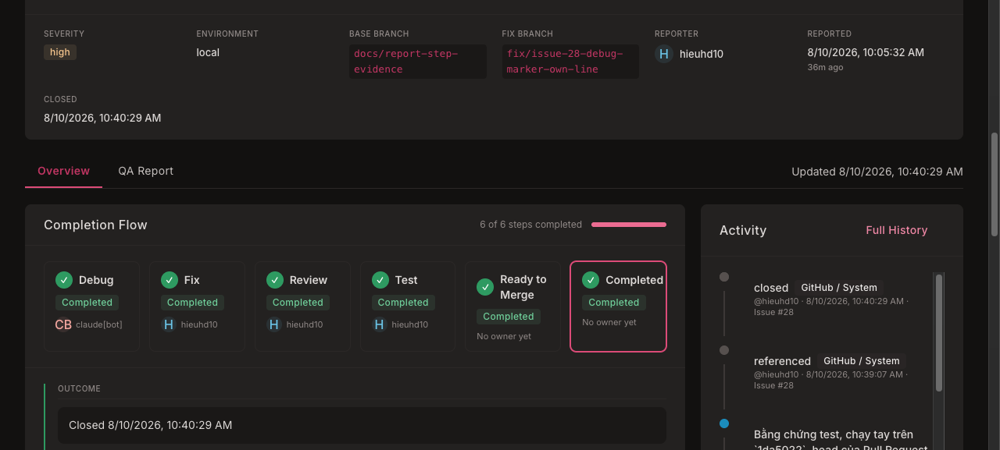

Tab **QA Report** tổng hợp bug description, root cause, fix record và test verification.

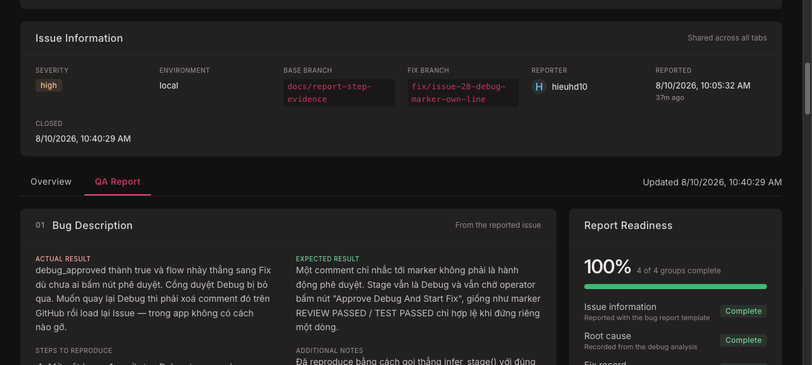

## Viết prompt cho Claude

Prompt sửa được trước khi gửi. Ba thứ phải giữ nguyên tiếng Anh vì engine và parser đọc đúng chữ:

| Giữ nguyên | Vì sao |
| --- | --- |
| `## Root Cause`, `## Solution`, `## Findings`, `## Test Result`, `## Remaining Risk`, `## Summary` | `_FIELD_HEADINGS` khớp theo đúng tên heading; sai tên thì reply thành unstructured và panel trên màn hình trống |
| `REVIEW PASSED` / `REVIEW FAILED`, `TEST PASSED` / `TEST FAILED` | engine khớp nguyên văn, phải đứng riêng một dòng |
| tiền tố `@claude` ở đầu comment | không có thì workflow không chạy |

Phần còn lại viết tiếng Việt thoải mái — Claude trả lời tiếng Việt bình thường. Cả 3 lần trong Issue #28 đều vậy.

Bốn câu nên có sẵn trong prompt, mỗi câu đổi lấy một lần phải sửa hậu quả:

1. **Chỉ đích danh nhánh**, kèm câu "hãy tự kiểm tra bạn đang đọc file ở nhánh nào trước khi trích số dòng".
2. **Khoanh phạm vi sửa** — nêu rõ cái gì thuộc issue khác, đừng gộp.
3. **"Nếu không chạy được test thì nói thẳng, đừng suy đoán kết quả."**
4. **"Khi trích chuỗi marker, chèn `&#8203;` vào giữa."**

Câu 1 tạo khác biệt lớn nhất. Ở Issue #26 không có nó, Claude khẳng định đã đọc nhánh được chỉ định trong khi thực tế đọc nhánh default và trích số dòng sai. Ở Issue #28 có nó, Claude tự khai báo rằng nó chỉ đọc được nhánh default và cảnh báo số dòng có thể lệch — cùng một giới hạn, nhưng thành thông tin dùng được thay vì khẳng định sai.

## Kiểm gì khi Claude báo đã xong

Ba thứ dưới đây lặp lại ở cả Issue #26 và #28.

| Kiểm gì | Vì sao |
| --- | --- |
| **PR có thật sự tồn tại không** | Cả hai lần Claude đều tick "Open Pull Request" là done trong khi chỉ push nhánh và để lại link compare. Kiểm bằng `gh pr list` hoặc nhìn ô PULL REQUEST trên màn hình. |
| **Nhánh nó thực sự đọc** | Workflow checkout `fetch-depth: 1` trên nhánh default, và mọi lệnh mạng trong sandbox đều bị chặn. Claude **không bao giờ** đọc được tip thật của một nhánh base khác. Nhánh nó push ra cũng tách từ nhánh default, nên phải cherry-pick hoặc rebase sang nhánh base đúng. |
| **Kết quả test là chạy thật hay trace tay** | Trong sandbox của Action, `pytest`, `ruff`, `mypy`, cả `python3 -c` đều bị permission chặn. Mọi phát biểu của Claude về test là suy luận, trừ khi có log thật. |

Đổi lại, có những thứ Claude làm tốt và không cần sửa: root cause đúng ở cả hai issue ngay lần đầu; ở #28 nó phát hiện chính tài liệu này sẽ sai sau khi merge — một finding nằm ngoài diff mà chỉ đọc rộng mới thấy; và nó tự từ chối ghi kết quả test khi không kiểm chứng được. Không phải lần nào cũng phải sửa AI; việc của operator là biết chỗ nào cần kiểm.

## Lần chạy trong tài liệu này

| | |
| --- | --- |
| Issue | [#28](https://github.com/hieuhd10/claude_schedule/issues/28) — marker phê duyệt Debug khớp ở mọi vị trí |
| Pull Request | [#29](https://github.com/hieuhd10/claude_schedule/pull/29), base `docs/report-step-evidence`, merge `0081b99` |
| Bản sửa | `1da5022` của `claude[bot]`, cherry-pick `-x` sang nhánh base đúng |
| Claude runs | Debug 3m15s · Fix 5m27s · Review 4m00s |
| Kiểm chứng | `pytest` 97 passed · `vitest` 44 passed · `mypy` clean · `ruff` 1 lỗi có sẵn ở `api/routes.py` |
| Tổng thời gian | 35 phút |
