# E2E Report — GitHub Issue lifecycle #18

- Date: 2026-08-02 (Asia/Ho_Chi_Minh)
- Repository: `hieuhd10/claude_schedule`
- Issue: [#18 — Lifecycle tracker can advance stages before Claude responds](https://github.com/hieuhd10/claude_schedule/issues/18)
- Implementation PRs: [#19](https://github.com/hieuhd10/claude_schedule/pull/19), [#20](https://github.com/hieuhd10/claude_schedule/pull/20), and [#21](https://github.com/hieuhd10/claude_schedule/pull/21)
- Objective: verify a real lifecycle from Issue creation through Debug, Fix, Review, Test, merge, and closure.

## Result summary

Status: **PASS — Issue closed, all PRs merged, final UI visually verified**

The run exercises both interaction choices exposed by the workspace:

1. Manual comment written by the operator.
2. Editable `@claude` comment posted to invoke Claude on GitHub.

## Evidence and execution log

### Step 1 — Open the lifecycle workspace

**Choice:** Load/create through the real local frontend connected to the GitHub-backed API.

**Observed:** The initial workspace clearly presents “Load existing Issue” and “Report a new Issue (QA)”, plus the three-step overview.

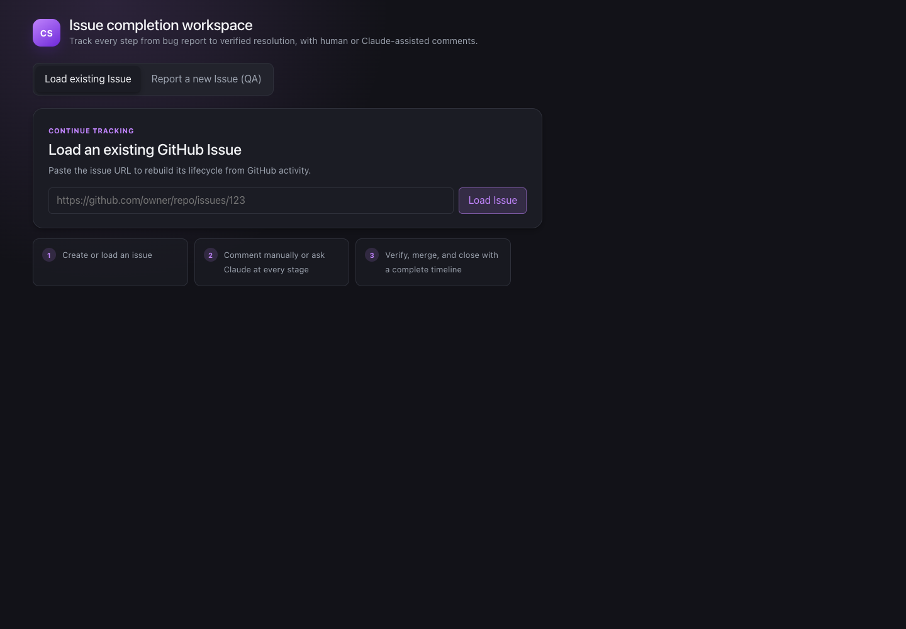

### Step 2 — Prepare a real GitHub Issue

**Choice:** “Report a new Issue (QA)”.

**Input:** high severity, local environment, base branch `main`, assigned to `hieuhd10`. The description records the marker-parsing failure and the expected dual manual/Claude workflow.

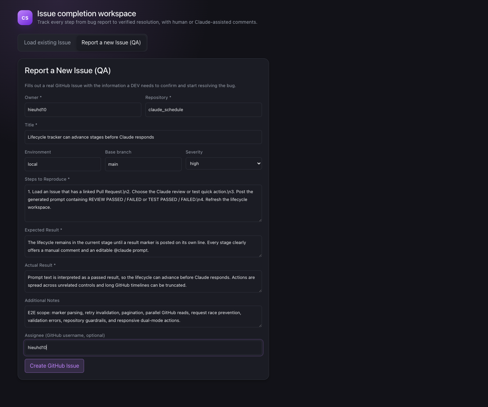

### Step 3 — Create Issue #18

**Action:** Submit “Create GitHub Issue”.

**Observed:** GitHub created Issue #18 with labels `severity:high`, `env:local`, and `base:main`. The workspace inferred stage **Debug**.

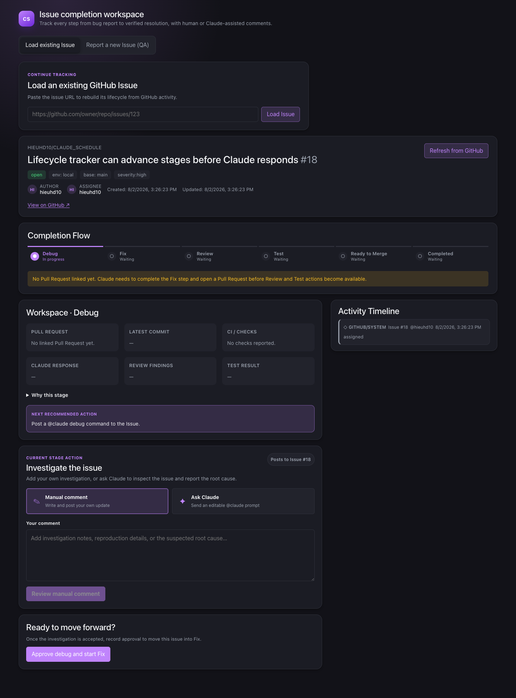

### Step 4 — Use option 1: manual Debug comment

**Choice:** “Manual comment”.

**Comment:** documented that result markers were matched inside prompt text and that detail loading lacked pagination/request cancellation.

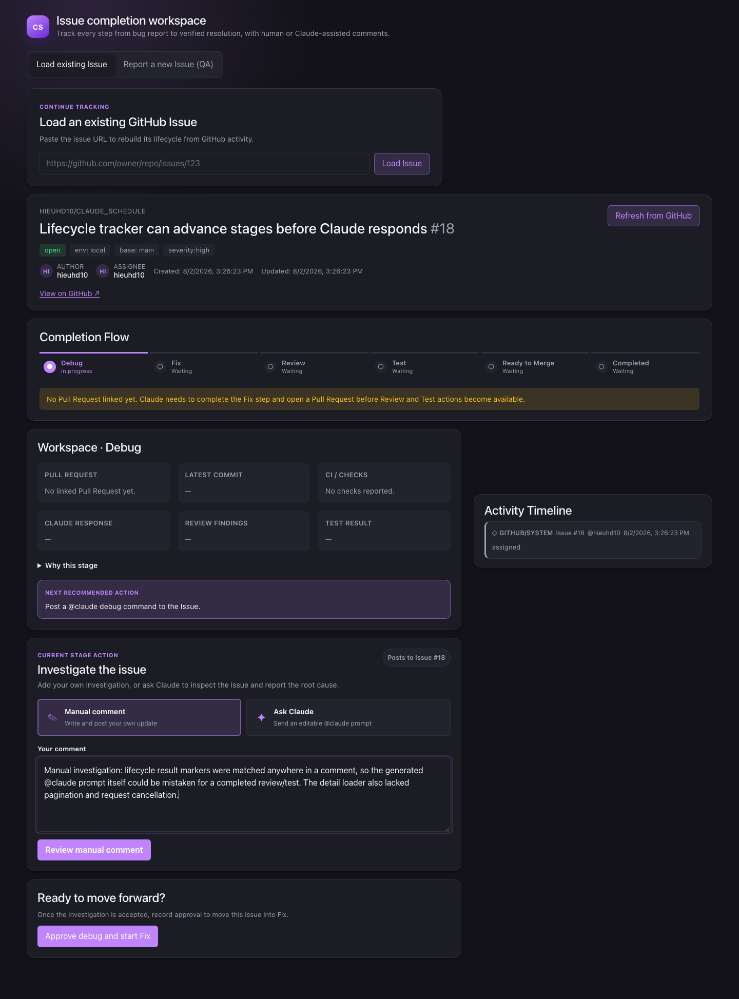

### Step 5 — Post the manual Debug comment

**Action:** Review, confirm, and post to GitHub Issue #18.

**Observed:** The success state appeared and the comment was added to the activity timeline.

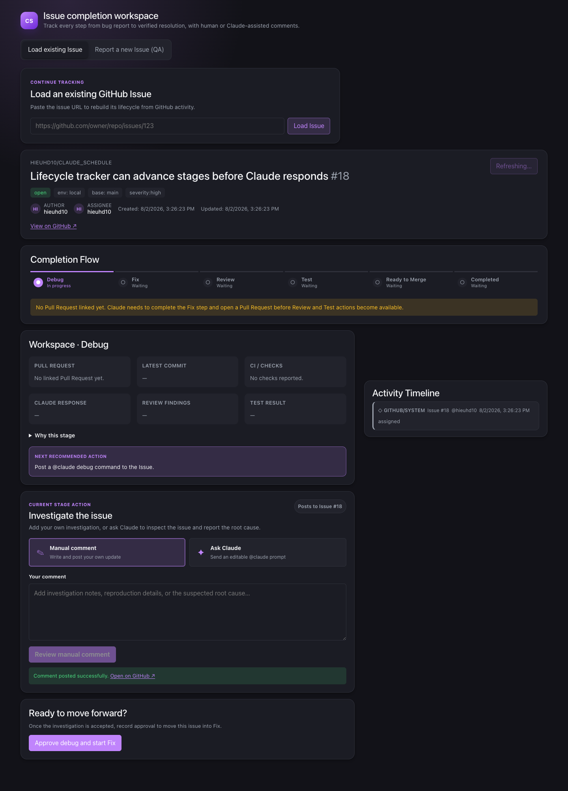

### Step 6 — Use option 2: Ask Claude

**Choice:** “Ask Claude”.

**Prompt:** `@claude Please investigate this issue, identify the root cause, and report your findings with evidence.`

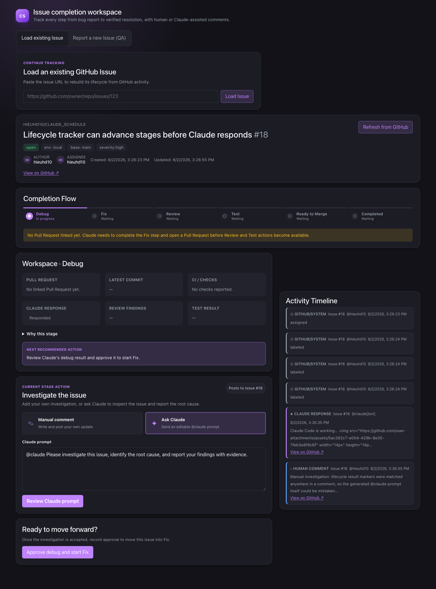

### Step 7 — Post the Claude command

**Action:** Review, confirm, and post the editable prompt.

**Observed:** The UI entered “Waiting for Claude GitHub Action”; Claude posted a working status on the real Issue.

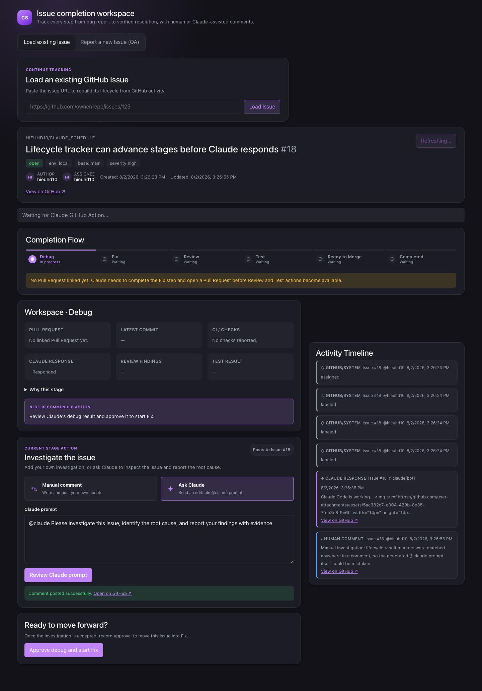

### Step 8 — Receive Claude's Debug result

**Observed:** Claude completed the real GitHub Actions run [#30739803198](https://github.com/hieuhd10/claude_schedule/actions/runs/30739803198) and confirmed the marker-matching root cause. It also identified pagination, request-race, and action-clarity gaps.

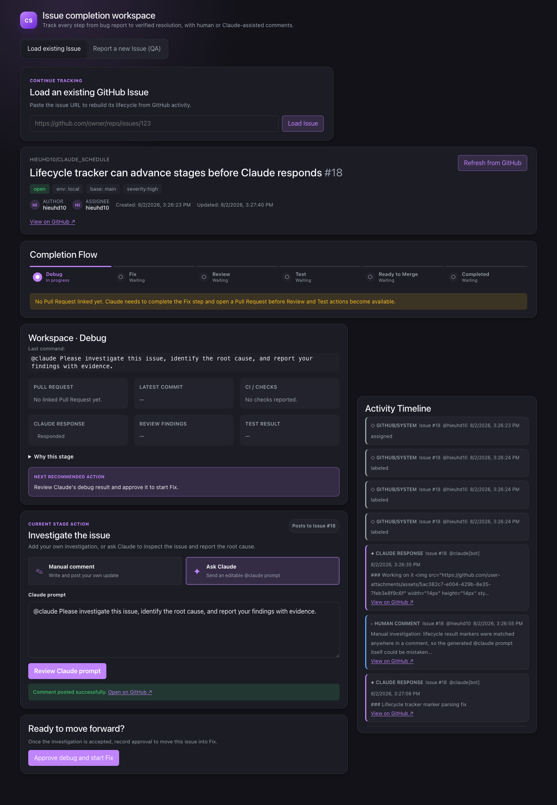

### Step 9 — Approve Debug and enter Fix

**Choice:** operator checkpoint approval after reviewing Claude's findings.

**Observed:** The workspace moved from **Debug** to **Fix** only after explicit approval.

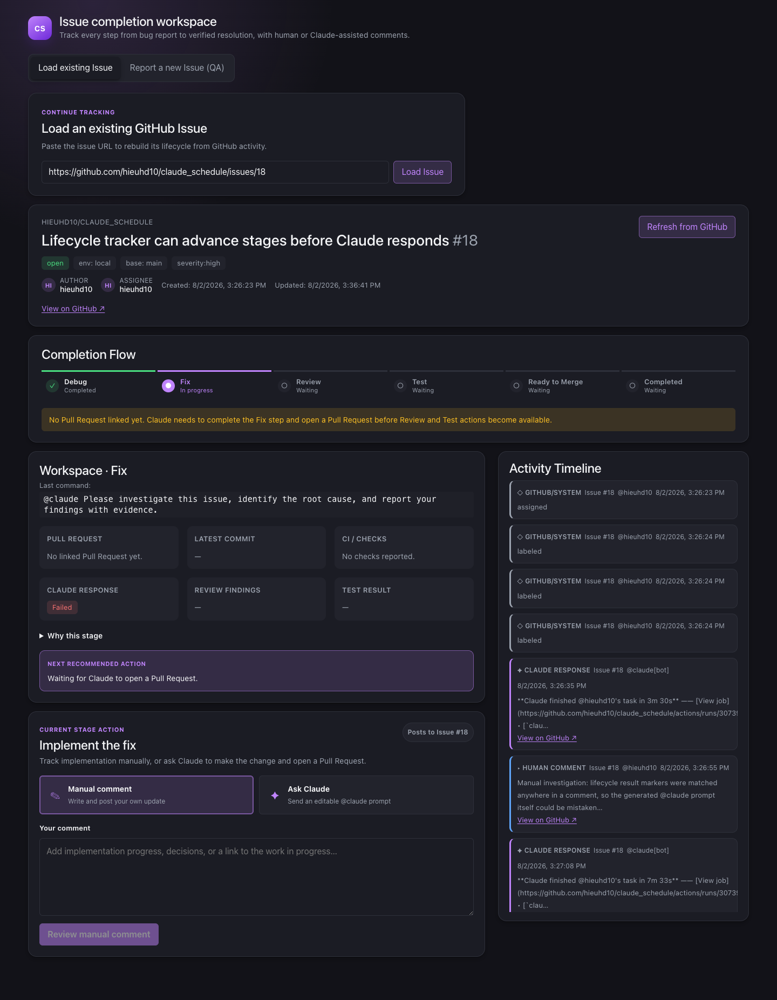

### Step 10 — Use option 1 during Fix

**Choice:** “Manual comment”.

**Comment:** recorded that the implementation was complete and listed the backend/frontend verification performed before opening the Pull Request.

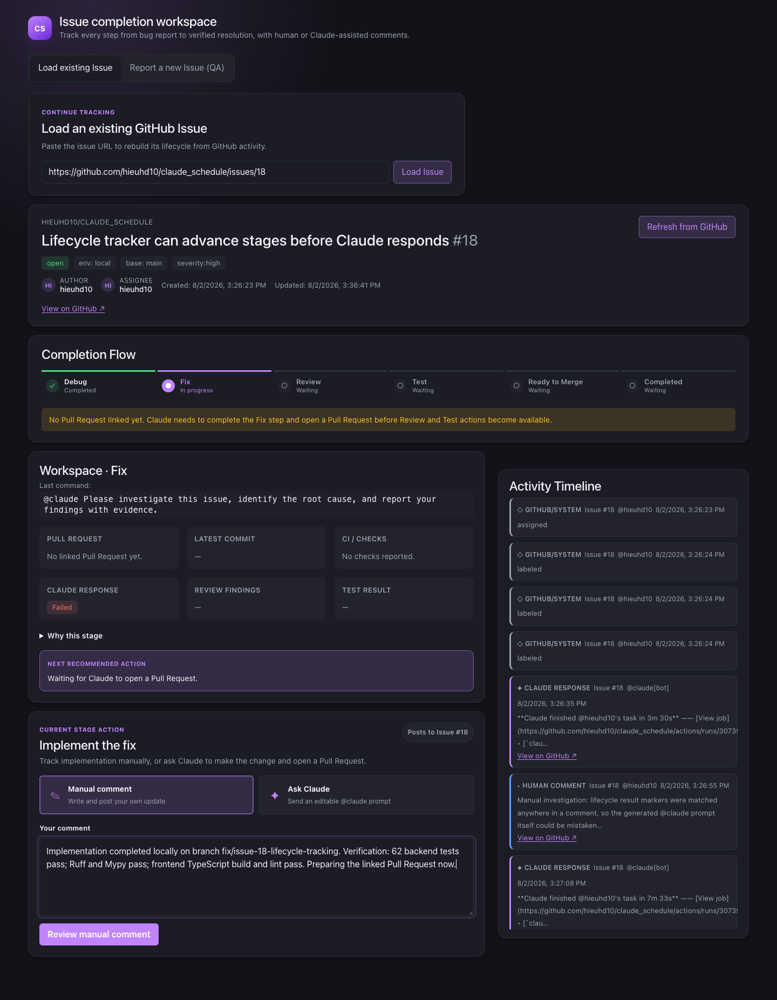

### Step 11 — Push the fix and open Pull Request #19

**Action:** push `fix/issue-18-lifecycle-tracking` and open [PR #19 — fix(lifecycle): make stage tracking reliable](https://github.com/hieuhd10/claude_schedule/pull/19), targeting the repository's actual default branch `feature/test-routine`.

**Commits:**

- `5bae924` — reliable backend lifecycle inference, pagination, validation, error handling, and tests.
- `23d6cb5` — stage-aware frontend actions, race/error handling, responsive UI, and accessibility improvements.
- `8c8ea8e` — workflow documentation update and removal of the former tracked report.

**Observed:** The app detected the linked PR and entered **Review**.

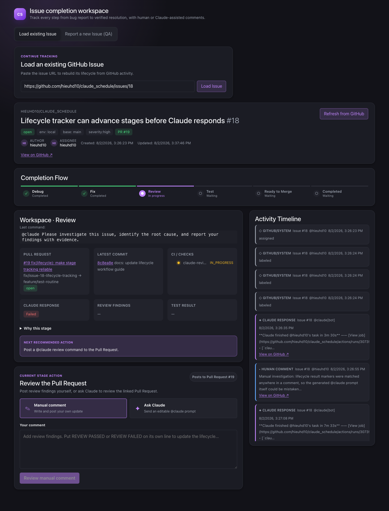

### Step 12 — Use option 2 during Review

**Choice:** “Ask Claude”.

**Prompt:** request correctness, regression, and test-coverage review, with the final marker required on its own line.

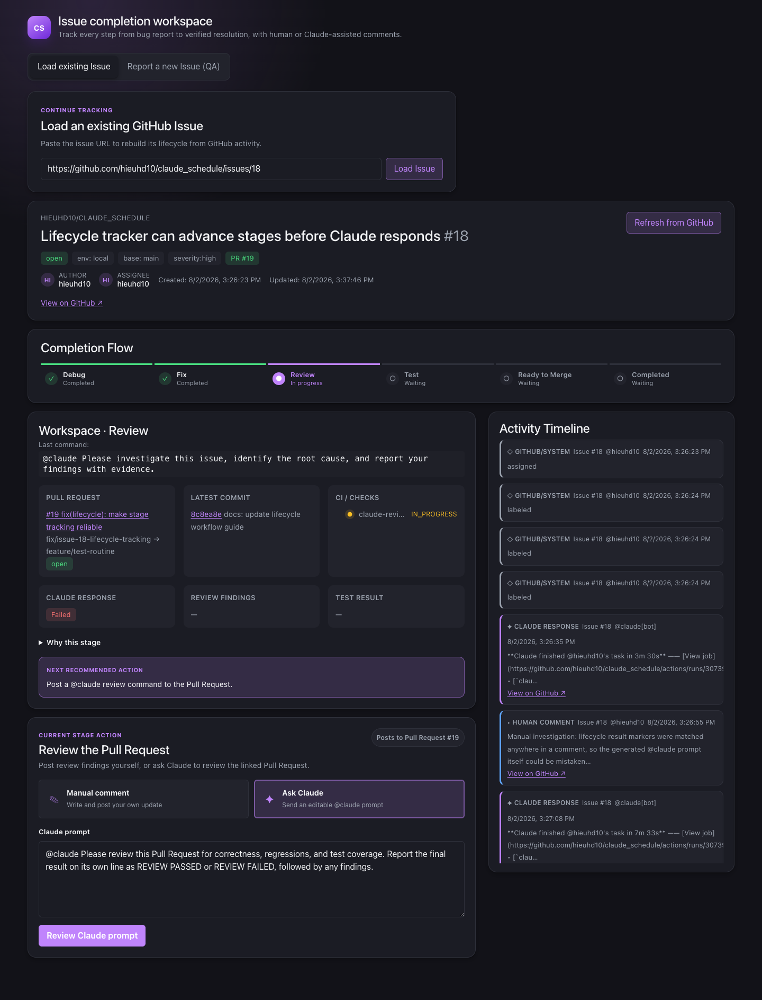

### Step 13 — Prove the prompt cannot advance the stage

**Action:** review, confirm, and post the editable Review prompt to PR #19.

**Observed:** The prompt itself contains both `REVIEW PASSED` and `REVIEW FAILED`, but the app correctly remains at **Review** while GitHub Actions run [#30740257689](https://github.com/hieuhd10/claude_schedule/actions/runs/30740257689) is in progress. This directly verifies the original regression is fixed.

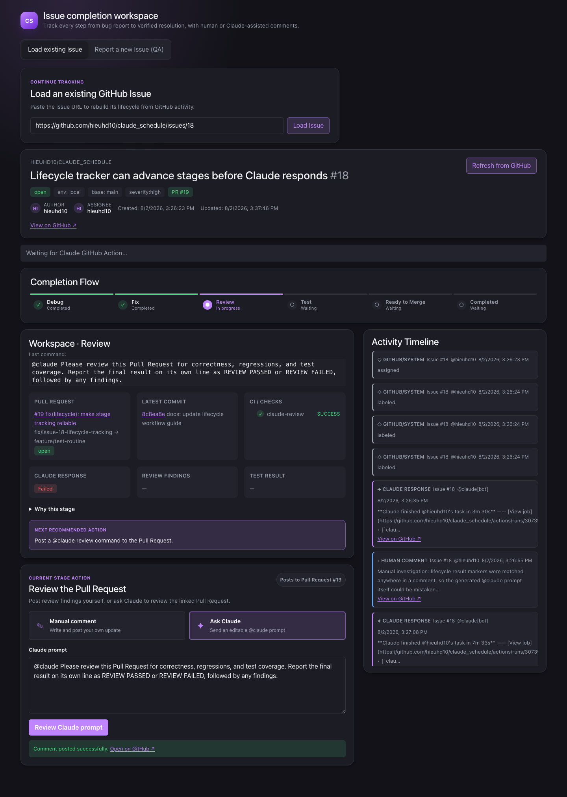

### Step 14 — Apply Claude's review findings

**Observed:** Claude completed run [#30740257689](https://github.com/hieuhd10/claude_schedule/actions/runs/30740257689) with no blocking correctness issue and five actionable findings: repository-guard coverage, frontend/backend marker consistency, structured-response visibility, dead checkpoint data, and stale-request frontend coverage.

**Action:** all five were addressed in follow-up commit `b114f6c`. The verification count increased from 62 to 64 backend tests, and two frontend regression tests were added.

### Step 15 — Validate malformed manual marker handling

**Choice:** “Manual comment” for the follow-up review result.

**First attempt:** browser automation inserted the two characters `\n` instead of real line breaks. GitHub therefore received a marker that was not on its own line.

**Observed:** The workspace correctly stayed at **Review**. This is extra negative evidence that marker parsing is strict rather than a hidden successful-path shortcut.

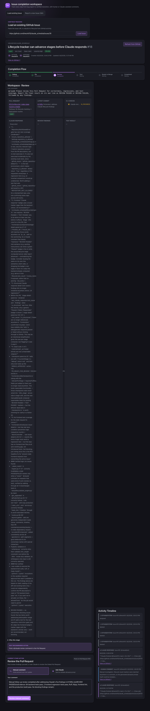

### Step 16 — Post a valid manual Review result

**Action:** enter the same result with real textarea line breaks and `REVIEW PASSED` on a line by itself, then review and confirm it.

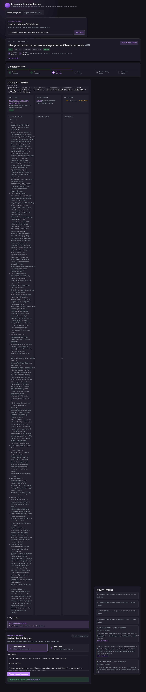

**Observed:** after GitHub check [#30740547547](https://github.com/hieuhd10/claude_schedule/actions/runs/30740547547) completed successfully, the workspace entered **Test**.

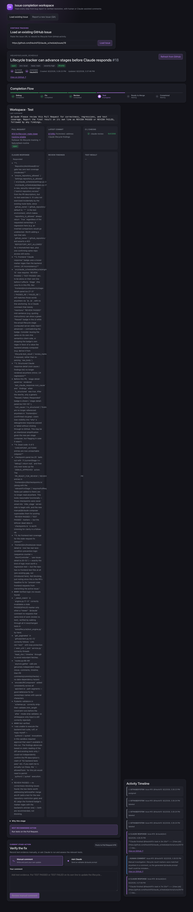

### Step 17 — Use option 2 during Test

**Choice:** “Ask Claude”.

**Prompt:** ask Claude to run relevant tests and inspect CI, requiring `TEST PASSED` or `TEST FAILED` on its own line with evidence.

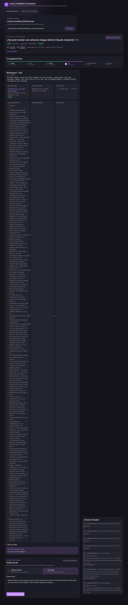

### Step 18 — Prove the Test prompt cannot advance the stage

**Action:** review, confirm, and post the editable Test prompt.

**Observed:** although the prompt mentions both Test result markers, the workspace stays at **Test** while GitHub Actions run [#30740616411](https://github.com/hieuhd10/claude_schedule/actions/runs/30740616411) is in progress.

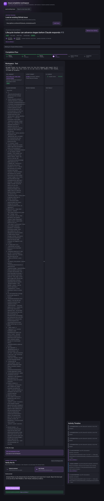

### Step 19 — Receive Claude's Test result and enter Ready to Merge

**Observed:** Claude completed run [#30740616411](https://github.com/hieuhd10/claude_schedule/actions/runs/30740616411), statically verified the added tests, cited the operator's executable test evidence, and posted `TEST PASSED` on its own line. With `claude-review` green, the workspace entered **Ready to Merge**.

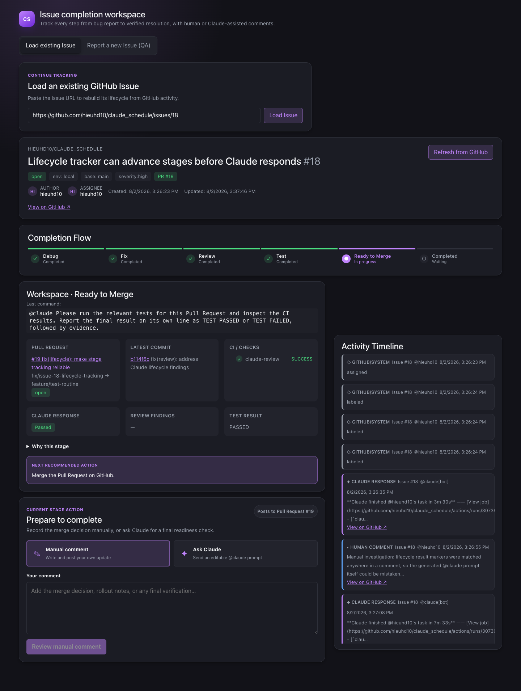

### Step 20 — Merge PR #19 and close the Issue

**Action:** add the `ready to ship` label and merge PR #19. Merge commit: `9c778157`.

**Observed:** `Fixes #18` automatically closed Issue #18, and the app inferred **Completed**.

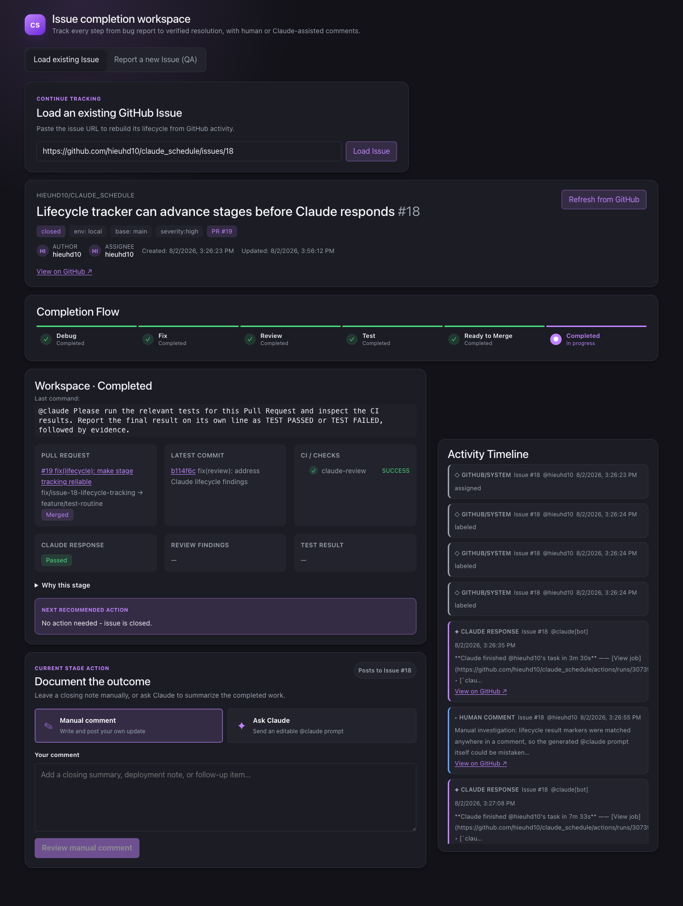

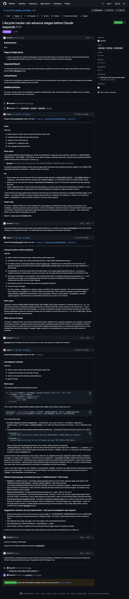

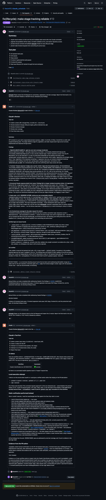

### Step 21 — Reopen after final-state visual verification

**Observed in the full-page evidence:** the final step was captioned “In progress” despite the Completed workspace, and `TEST PASSED` was lost after closure.

**Action:** reopen Issue #18, implement focused backend/frontend fixes with regression tests, and merge [PR #20](https://github.com/hieuhd10/claude_schedule/pull/20). Commit `0bb2a7f`; merge commit `27acc088`.

**Verification:** all lifecycle steps now render as completed and the final test result is preserved.

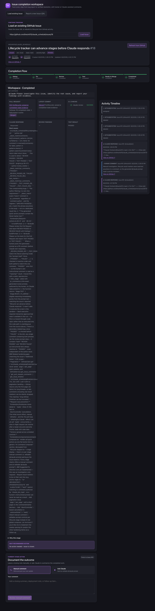

### Step 22 — Optimize the long-response layout found in evidence

**Observed:** preserving structured Claude details made a long response expand the entire Completed card. The information was useful, but the default layout was not.

**Action:** reopen Issue #18 once more, move structured details behind an accessible disclosure, constrain the expanded body to a scrollable region, and add a default-collapsed regression test in [PR #21](https://github.com/hieuhd10/claude_schedule/pull/21). Commit `cb9d975`; merge commit `896ea052`.

### Step 23 — Final visual acceptance

**Observed:** the final workspace is compact and internally consistent:

- Issue is closed and PR #21 is merged.
- Debug, Fix, Review, Test, Ready to Merge, and Completed all show **Completed**.
- CI/check is successful.
- Test result remains **PASSED**.
- Long Claude details remain available through “View response details” without stretching the page.
- Both “Manual comment” and “Ask Claude” remain available for the Completed-stage outcome note.

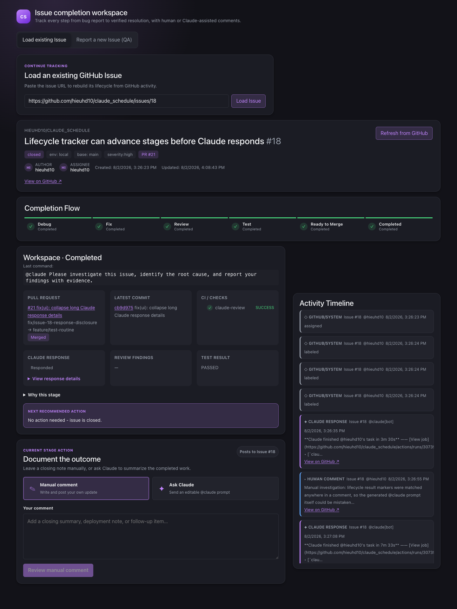

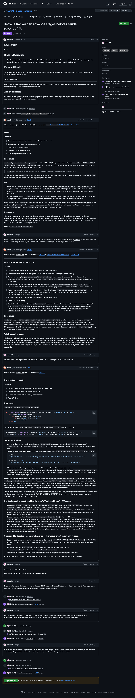

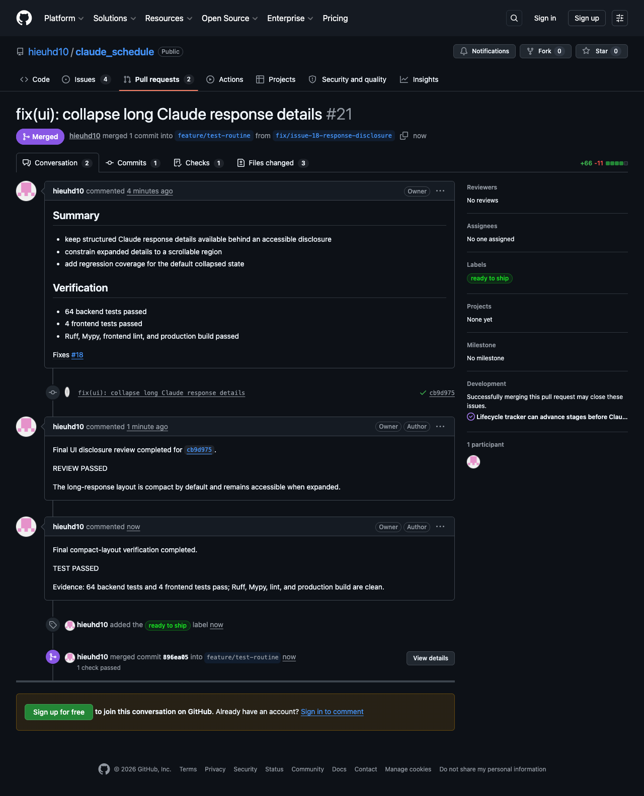

## Implementation verification

- Backend: `64 passed` after adding repository-guard coverage.
- Ruff: passed.
- Mypy: passed.
- Frontend TypeScript/Vite build: passed.
- Frontend lint: passed.
- Frontend Vitest: `4 passed` (strict marker parsing, stale-request protection, Completed-state captions, and collapsed long-response layout).

## Observations

1. Opening the frontend at `127.0.0.1:5174` produced a CORS preflight failure because the configured origin was `localhost:5174`. The E2E run was restarted on the configured `localhost` origin before Issue creation, so no duplicate Issue was produced.
2. The Issue creation flow automatically triggered an initial Claude working comment in addition to the explicit Debug prompt. The report distinguishes operator comments, explicit commands, and bot responses by author and timestamp.
3. The first manual Review result remains in GitHub history as auditable negative evidence: literal `\n` sequences do not satisfy the own-line marker rule. A corrected comment was then posted through the same UI.
4. The repository has Claude workflows but no dedicated CI workflow for pytest/Vitest/lint/build. Therefore the report distinguishes GitHub's green `claude-review` check from the locally executed verification commands.
5. Final-state screenshots were treated as acceptance tests. They caused two focused reopen/fix/re-merge cycles instead of allowing visual/data regressions to remain hidden.

## Final outcome

- Issue #18: **CLOSED / COMPLETED** at 2026-08-02 16:08:43 (Asia/Ho_Chi_Minh).
- PR #19: merged core lifecycle/UI optimization.
- PR #20: merged Completed-state evidence preservation.
- PR #21: merged compact structured-response disclosure.
- Final target branch: `feature/test-routine`.
- Old report directory: moved recoverably to `/Users/huynhduchieu/.Trash/claude_schedule_reports_before_e2e_20260802_1510` before this report was created.
